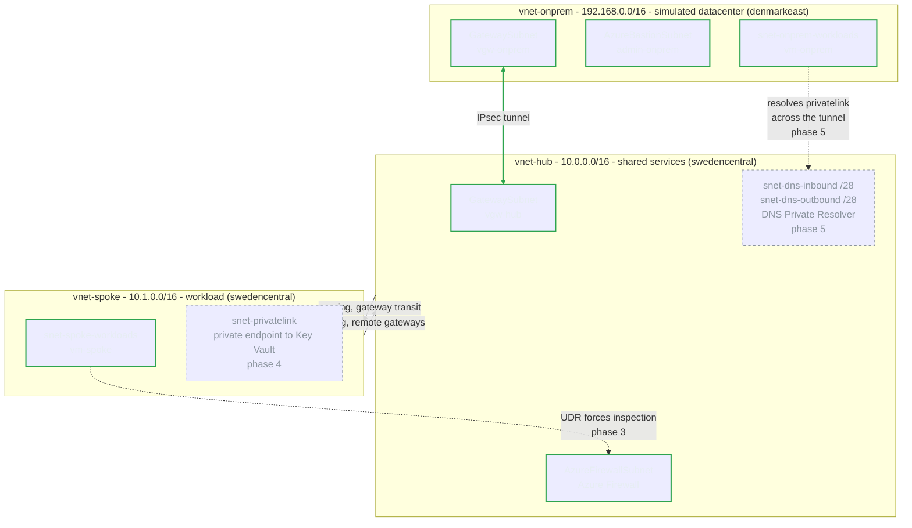

# Azure Private Hybrid Network

Three private Azure networks in separate address spaces, joined by an encrypted IPsec tunnel and VNet peering, with shared services centralized in a hub and zero public exposure on any workload. The hub and spoke are located in Sweden Central, with the simulated "on-prem" network in Denmark East.

This is the pattern for connecting two private networks that do not implicitly trust each other: an on-premises datacenter reaching into Azure, two separate cloud estates, or an acquired company's network. Here vnet-onprem plays the datacenter role, but the mechanics could be identical regardless of the scenario.

Built with Terraform and deployed from GitHub Actions.

## What it does

- **Encrypted connectivity between separate address domains.** An IPsec tunnel between
  two VPN gateways connects on-premises workloads in Denmark East with the cloud environment
  in Sweden Central. VNet peering with gateway transit allows the spoke to reach across the
  tunnel through the hub's gateway rather than deploying its own.
- **Centralised inspection.** A firewall in the hub uses user-defined routes (UDRs) to
  force spoke-to-on-premises traffic and spoke egress through it.
- **No public exposure.** Workloads have no public IPs. Administrative access goes through
  Azure Bastion, spoke egress leaves through the firewall instead of Azure's default SNAT,
  and Phase 4 will place PaaS access behind private endpoints.
- **Planned name resolution across the boundary.** Phase 5 will use Azure DNS Private Resolver
  so private names resolve in both directions across the hybrid boundary.
- **Keyless delivery.** OIDC federation into Entra ID eliminates static credentials in the repository.
  Infrastructure changes use remote state and execute only when manually triggered in GitHub Actions.

Built incrementally in phases, with each layer validated before moving to the next. Core networking, VPN connectivity, Bastion access, and the Azure Firewall are deployed; private endpoints and the DNS resolver are next.

---

## Architecture

Three non-overlapping ranges, chosen so the simulated on-prem datacenter looks nothing like the Azure side. Neither VM has a public IP; admin access is through Bastion to the "on-prem" vm. The spoke has no gateway on its own, which is the point of the network topology: one gateway in the hub that serves every spoke.

---

## Documentation

| Document | What is in it |
|---|---|
| [plan.md](plan.md) | The five phases, what is done, and what is deliberately not being built |
| [docs/worklog.md](docs/worklog.md) | What was built and in what order, with the evidence |
| [docs/decisions.md](docs/decisions.md) | Fifteen decisions as questions, each with what it was chosen over and what it gives up |
| [docs/troubleshooting.md](docs/troubleshooting.md) | Thirteen failures grouped by phase, with the real error, the root cause and the fix |
| [docs/terraform-patterns.md](docs/terraform-patterns.md) | The map, flatten and for_each pattern, and where it leaks |
| [docs/validation/README.md](docs/validation/README.md) | Phase-by-phase control-plane and data-plane evidence, including the Phase 3 firewall decisions |

---

## Stack

Azure (Sweden Central, Denmark East), Terraform with the AzureRM provider, GitHub Actions, Entra ID workload identity federation, Azure RBAC custom roles.
