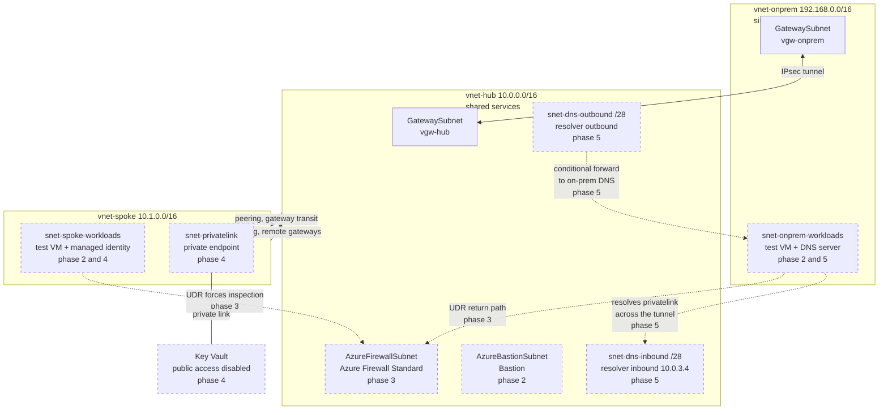

# Azure Hybrid Network Lab

An Azure hub-and-spoke network with a simulated on-premises site, defined entirely in Terraform and deployed from GitHub Actions with no stored Azure credentials.

---

## Target architecture

