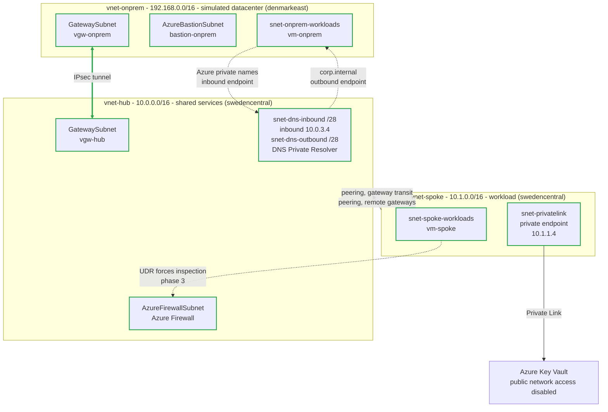

# Azure Hub-and-Spoke Network with "on-prem" integration

Three private networks in separate address spaces, joined by an encrypted IPsec tunnel and VNet peering, with shared services centralized in a hub and zero public exposure on any workload. The hub and spoke are located in Sweden Central, with the simulated "on-prem" network in Denmark East.

This is the pattern for connecting two private networks that do not implicitly trust each other: an on-premises datacenter reaching into Azure, two separate cloud estates, etc. Here "vnet-onprem" plays the on-premises datacenter role, but the mechanics could be identical regardless of the scenario.

Built with Terraform and deployed with GitHub Actions.

## What it does

- **Encrypted connectivity between separate address domains.** An IPsec tunnel between
  two VPN gateways connects on-premises workloads in Denmark East with the cloud environment
  in Sweden Central. VNet peering with gateway transit allows the spoke to reach across the
  tunnel through the hub's gateway rather than deploying its own.
- **Centralised inspection.** A firewall in the hub uses user-defined routes (UDRs) to
  force spoke-to-on-premises traffic and spoke egress through it.
- **No public exposure.** Workloads have no public IPs. Administrative access goes through
  Azure Bastion, spoke egress leaves through the firewall instead of Azure's default SNAT,
  and Key Vault data-plane access uses a private endpoint with public access disabled.
- **Bidirectional hybrid name resolution.** Azure DNS Private Resolver lets the simulated
  datacenter resolve Azure private endpoints and lets Azure workloads resolve the
  `corp.internal` namespace across the tunnel.
- **Keyless delivery.** OIDC federation into Entra ID eliminates static credentials in the repository.
  Infrastructure changes use remote state and execute only when manually triggered in GitHub Actions.

Built incrementally in phases, with each layer validated before moving to the next. Phases 0 through
5 are complete: core networking, VPN connectivity, Bastion access, Azure Firewall, private Key
Vault access, and bidirectional hybrid DNS are deployed and validated.

---

## Architecture

---

## Documentation

| Document | What's in it |
|---|---|
| [docs/architecture.md](docs/architecture.md) | How traffic moves end to end, and which control enforces each hop |
| [docs/worklog.md](docs/worklog.md) | What was built and in what order, with the evidence |
| [docs/decisions.md](docs/decisions.md) | Architecture decisions as questions, each with alternatives and trade-offs |
| [docs/troubleshooting.md](docs/troubleshooting.md) | Real failures and diagnostic traps grouped by phase, with the error, root cause, and fix |
| [docs/validation/README.md](docs/validation/README.md) | Phase-by-phase control-plane and data-plane evidence through Phase 5 hybrid DNS |
