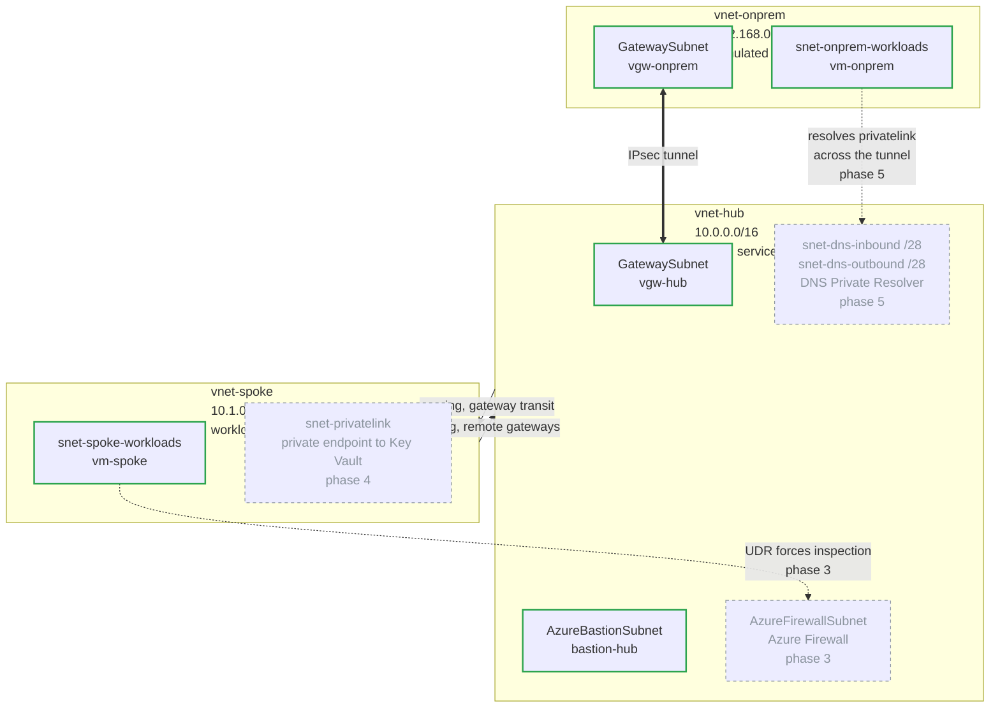

# Azure Private Hybrid Network

Three private Azure networks in separate address spaces, joined by an encrypted IPsec tunnel
and VNet peering, with shared services centralised in a hub and no public exposure on any
workload.

This is the pattern for connecting two private networks that do not implicitly trust each
other: an on-prem datacenter reaching into Azure, two separate cloud estates, or a company
you have just acquired. Here `vnet-onprem` plays the datacenter role, but the mechanics are
identical whichever it is.

Built with Terraform and deployed from GitHub Actions.

## What it does

- **Encrypted connectivity between separate address domains.** An IPsec tunnel between two
  VPN gateways, plus VNet peering with gateway transit, so the spoke reaches across the
  tunnel through the hub's gateway instead of paying for one of its own.
- **Centralised inspection.** A firewall in the hub with user-defined routes that force
  traffic through it, rather than letting the peering carry it straight past. Nothing moves
  between networks uninspected.
- **No public exposure.** No workload has a public IP. Admin access goes through Bastion,
  PaaS is reached over private endpoints instead of public service endpoints, and egress
  leaves through the firewall rather than Azure's default SNAT.
- **Name resolution across the boundary.** A DNS Private Resolver so private names resolve
  in both directions, which is the part that usually breaks in hybrid setups.
- **Keyless delivery.** OIDC federation into Entra ID, so no Azure credential exists in this
  repository. Remote state, and applies that only run when someone deliberately presses the
  "deploy" button in GitHub Actions.

Built in phases, each one exercised before the next starts. Phases 0 to 2 are deployed and
validated; the firewall, private endpoints and DNS resolver are next. The diagram below marks
which is which.

---

## Architecture

Green is deployed. Dashed grey is planned, tagged with the phase that adds it.

Three non-overlapping ranges, chosen so the simulated datacenter looks nothing like the Azure side. Neither VM has a public IP; access is through Bastion. The spoke has no gateway on its own, which is the point of the network topology: one gateway in the hub that serves every spoke.

---

## Documentation

| Document | What is in it |
|---|---|
| [plan.md](plan.md) | The five phases, what is done, and what is deliberately not being built |
| [docs/worklog.md](docs/worklog.md) | What was built and in what order, with the evidence |
| [docs/decisions.md](docs/decisions.md) | Fourteen decisions as questions, each with what it was chosen over and what it gives up |
| [docs/troubleshooting.md](docs/troubleshooting.md) | Ten failures grouped by phase, with the real error, the root cause and the fix |
| [docs/terraform-patterns.md](docs/terraform-patterns.md) | The map, flatten and for_each pattern, and where it leaks |

The troubleshooting log is the one worth reading. Four of the ten were Azure withdrawing something that only failed at apply time, and two had error messages that named the wrong layer entirely.

---

## Stack

Azure (Sweden Central), Terraform with the AzureRM provider, GitHub Actions, Entra ID workload identity federation, Azure RBAC custom roles.
