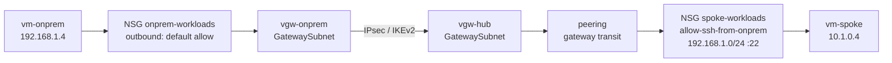
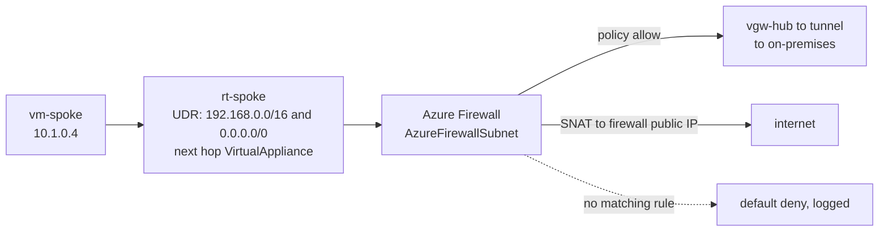
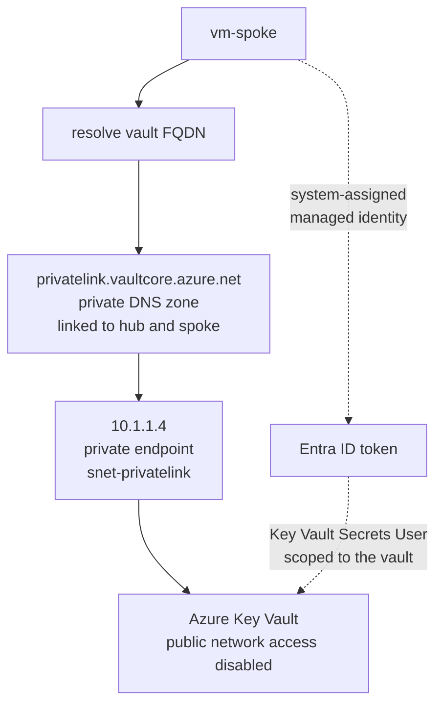
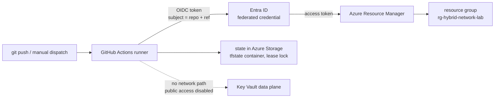

```mermaid
flowchart TB
    subgraph IN["Inbound: on-premises resolves Azure private names"]
        A1["vm-onprem<br/>VNet DNS = 10.0.3.4"] --> B1["resolver inbound endpoint<br/>snet-dns-inbound 10.0.3.4"]
        B1 --> C1["Azure-provided DNS"]
        C1 --> D1["privatelink zone<br/>returns 10.1.1.4"]
    end

    subgraph OUT["Outbound: Azure resolves corp.internal"]
        A2["vm-spoke"] --> B2["ruleset-hub<br/>linked to hub and spoke"]
        B2 -->|"rule: corp.internal."| C2["resolver outbound endpoint<br/>snet-dns-outbound"]
        C2 -->|"UDP and TCP 53<br/>across the tunnel"| D2["dnsmasq on vm-onprem<br/>192.168.1.4"]
    end
```

# Architecture

How traffic moves through this lab, and which control decides each hop.

The [README](../README.md) shows the topology. This document shows the paths.

---

## The controls

A packet leaving a workload meets these in sequence. Missing one is usually why a flow that should
work does not.

| Order | Control | Scope | Where it lives |
|---|---|---|---|
| 1 | NSG outbound rules | Source subnet | [`locals.tf`](../terraform/locals.tf) `network_security_groups` |
| 2 | Route table (UDR) | Source subnet | [`modules/routing`](../terraform/modules/routing/main.tf) |
| 3 | Firewall policy | Hub, if the route sends it there | [`modules/firewall`](../terraform/modules/firewall/main.tf) |
| 4 | Peering flags | Hub and spoke | [`main.tf`](../terraform/main.tf) `azurerm_virtual_network_peering` |
| 5 | VPN connection | Hub and on-premises | [`modules/connectivity`](../terraform/modules/connectivity/main.tf) |
| 6 | NSG inbound rules | Destination subnet | [`locals.tf`](../terraform/locals.tf) `network_security_groups` |
| 7 | Azure RBAC | Data plane, PaaS only | [`main.tf`](../terraform/main.tf) `azurerm_role_assignment` |

---

## Flow 1: on-premises to spoke workload

The core hybrid path. Proves the tunnel, gateway transit, and both NSGs.

The spoke has no gateway of its own. It reaches on-premises because the hub peering sets
`allow_gateway_transit` and the spoke sets `use_remote_gateways` (decision 2). Remove either flag
and the path dies with no error on the data plane.

The return path is not symmetric by default. Spoke traffic heading to on-premises is pulled into the
firewall by a route table, which is flow 2.

**Evidence:** [phase-2-connectivity.md](validation/phase-2-connectivity.md)

---

## Flow 2: spoke to on-premises, and spoke to internet

Both leave the spoke through the firewall. The route table is what makes inspection unavoidable.

Without the route table the spoke would reach on-premises directly over gateway transit and the
firewall would never see the packet. The route is the enforcement, not the firewall.

A second route table on the hub `GatewaySubnet` sends on-premises traffic back through the firewall,
so both directions are inspected. Routing that is inspected one way only is the usual cause of a
connection that opens and then hangs.

**Evidence:** [phase-3-route+firewall.md](validation/phase-3-route+firewall.md)

---

## Flow 3: spoke to Key Vault over Private Link

No public endpoint, no stored credential, no traffic leaving the VNet.

Two separate gates, and both must pass. The network path exists only through the private endpoint,
and the data plane needs a role assignment. A VM that can resolve and reach the vault still gets a
403 without the role.

Terraform never reads from the vault (decision 14). The runner is a GitHub-hosted machine outside
the VNet, so with public access disabled it has no route to the data plane. That is deliberate, not
an oversight.

**Evidence:** [phase-4-private-link.md](validation/phase-4-private-link.md)

---

## Flow 4: hybrid DNS, both directions

The only flow where each network resolves private names owned by the other. A direct private-zone
link would not work against a real datacenter, which is why the resolver exists (decision 16).

Three things break this flow easily, all of them recorded as real failures:

- The inbound endpoint IP is pinned to `10.0.3.4` because the simulated site hard-codes it. A
  dynamic address would break the site silently on every rebuild.
- Both resolver subnets are delegated `/28`s that can host nothing else. Azure requires this.
- The on-premises NSG must allow both UDP and TCP on port 53 from `10.0.3.16/28`. TCP is not
  optional, because large answers and retries need it.

`nslookup` on Ubuntu reports server `127.0.0.53` no matter what, because that is the local
`systemd-resolved` stub. It tells you nothing about which upstream actually answered.

**Evidence:** [phase-5-dns-resolver.md](validation/phase-5-dns-resolver.md)

---

## Flow 5: the delivery path

How changes reach Azure. No stored cloud credential exists anywhere in this flow.

The runner gets a short-lived token that proves which repository and ref is running (decision 3).
The custom RBAC role limits what that token can do (decision 4). The dashed line is the intended
gap: the pipeline can create the vault but cannot read from it.

**Evidence:** [phase-0-pipeline.md](validation/phase-0-pipeline.md)

---

## Reading a failure

When a flow breaks, the useful question is which hop stopped it.

| Symptom | Likely hop | First command |
|---|---|---|
| Refused immediately | NSG (1 or 6) | `az network watcher test-ip-flow` |
| Hangs, then times out | Route table (2), or a one-way return path | `az network watcher show-next-hop` |
| Works one direction only | Route table on one side only | compare `show-next-hop` both ways |
| Name resolves to a public IP | Private DNS zone link (flow 3) | `dig` the FQDN, look for `privatelink` |
| Name does not resolve at all | Resolver ruleset link or rule (flow 4) | `dig @10.0.3.4` directly |
| Reaches the service, returns 403 | RBAC (7), not networking | `az role assignment list --scope` |

A check that passes on the control plane but fails on the data plane is the interesting case. That
gap is how the Phase 2 Bastion routing problem was found.
