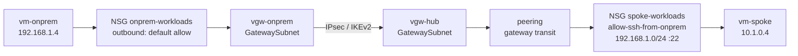
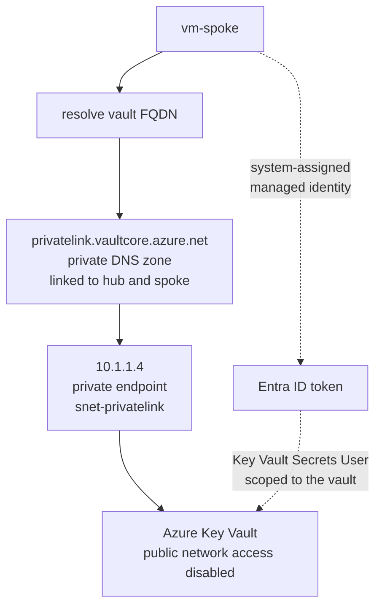
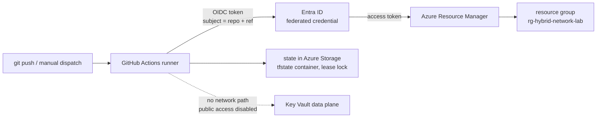

# Architecture

How traffic actually moves through this lab, and which control decides each hop.

The [README](../README.md) shows the topology. This document shows the paths. Every flow below
has a matching evidence record in [docs/validation](validation/README.md); the reasoning behind each
control is in [decisions.md](decisions.md).

---

## The controls, in evaluation order

A packet leaving a workload meets these in sequence. Missing one is usually why a flow that "should
work" doesn't.

| Order | Control | Scope | Where it lives |
|---|---|---|---|
| 1 | NSG outbound rules | Source subnet | [`locals.tf`](../terraform/locals.tf) `network_security_groups` |
| 2 | Route table (UDR) | Source subnet | [`modules/routing`](../terraform/modules/routing/main.tf) |
| 3 | Azure Firewall policy | Hub, if the UDR sends it there | [`modules/firewall`](../terraform/modules/firewall/main.tf) |
| 4 | VNet peering flags | Hub ↔ spoke | [`main.tf`](../terraform/main.tf) `azurerm_virtual_network_peering` |
| 5 | VPN gateway connection | Hub ↔ on-prem | [`modules/connectivity`](../terraform/modules/connectivity/main.tf) |
| 6 | NSG inbound rules | Destination subnet | [`locals.tf`](../terraform/locals.tf) `network_security_groups` |
| 7 | Azure RBAC | Data plane, PaaS only | [`main.tf`](../terraform/main.tf) `azurerm_role_assignment` |

Name resolution runs on its own path and is evaluated before any of this — a flow that fails at
step 0 never reaches step 1. That is the most common false diagnosis in this lab, and why
[troubleshooting.md](troubleshooting.md) has three separate DNS entries.

---

## Flow 1 — on-premises to spoke workload

The core hybrid path. Proves the tunnel, gateway transit, and both NSGs.

The spoke has no gateway of its own. It reaches on-premises because the hub peering sets
`allow_gateway_transit` and the spoke side sets `use_remote_gateways` — decision 2. Remove either
flag and this path dies with no error message on the data plane.

The return path is **not** symmetric by default: spoke-to-on-premises egress is pulled into the
firewall by UDR (flow 2). That asymmetry was deliberate and is what Phase 3 validated.

**Evidence:** [phase-2-connectivity.md](validation/phase-2-connectivity.md)

---

## Flow 2 — spoke to on-premises, and spoke to internet

Both leave the spoke through the firewall. The UDR is what makes inspection unavoidable.

Without the UDR the spoke would reach on-premises directly over gateway transit and the firewall
would never see the packet. The route table is the enforcement, not the firewall.

A second UDR on the hub `GatewaySubnet` returns on-premises-to-spoke traffic through the firewall
as well, so both directions are inspected rather than only one. Asymmetric routing here is the
classic cause of a connection that opens and then hangs.

**Evidence:** [phase-3-route+firewall.md](validation/phase-3-route+firewall.md)

---

## Flow 3 — spoke to Key Vault over Private Link

No public endpoint, no credentials, no traffic leaving the VNet.

Two independent gates, and both must pass: the **network** path exists only through the private
endpoint, and the **data plane** requires an RBAC role assignment. A VM that can resolve and reach
the vault still gets `403` without the role.

Terraform never reads from the vault — decision 14. The runner is a GitHub-hosted machine outside
the VNet, so with public access disabled it has no path to the data plane at all. That constraint is
load-bearing, not an oversight.

**Evidence:** [phase-4-private-link.md](validation/phase-4-private-link.md)

---

## Flow 4 — hybrid DNS, both directions

The only flow where the two networks resolve each other's private namespaces. This is what
DNS Private Resolver exists for; a direct private-zone link would not work against a real
datacenter — decision 16.

```mermaid
flowchart TB
    subgraph IN["Inbound: on-premises resolves Azure private names"]
        A1["vm-onprem<br/>VNet DNS = 10.0.3.4"] --> B1["resolver inbound endpoint<br/>snet-dns-inbound 10.0.3.4"]
        B1 --> C1["Azure-provided DNS"]
        C1 --> D1["privatelink zone<br/>returns 10.1.1.4"]
    end

    subgraph OUT["Outbound: Azure resolves corp.internal"]
        A2["vm-spoke"] --> B2["ruleset-hub<br/>linked to hub and spoke"]
        B2 -->|"rule: corp.internal."| C2["resolver outbound endpoint<br/>snet-dns-outbound"]
        C2 -->|"UDP and TCP 53<br/>across the tunnel"| D2["dnsmasq on vm-onprem<br/>192.168.1.4"]
    end
```

Three things about this flow break easily, all of them recorded as real failures:

- The inbound endpoint IP is **pinned static** at `10.0.3.4` because the simulated site's DNS config
  hard-codes it. A dynamic address would silently break the site on every rebuild.
- Both resolver subnets are delegated `/28`s to `Microsoft.Network/dnsResolvers` and can host
  nothing else. That is a service requirement, not a design choice.
- The on-premises NSG must allow **both UDP and TCP** port 53 from the outbound subnet
  `10.0.3.16/28`. TCP is not optional — large answers and retries need it.

`nslookup` on Ubuntu reports server `127.0.0.53` regardless of any of this, because that is the
`systemd-resolved` stub. It says nothing about which upstream actually answered.

**Evidence:** [phase-5-dns-resolver.md](validation/phase-5-dns-resolver.md)

---

## Flow 5 — the delivery path

How infrastructure changes reach Azure. No stored cloud credential exists anywhere in this flow.

The runner authenticates with a short-lived token proving *which repository and ref* is running —
decision 3. The custom RBAC role limits what that token can do — decision 4. The dashed line is the
deliberate gap: the pipeline can create the vault but cannot read from it.

**Evidence:** [phase-0-pipeline.md](validation/phase-0-pipeline.md)

---

## Reading a failure

The two-plane split in [validation/README.md](validation/README.md) maps onto this document
directly. When a flow fails, the useful question is which hop above stopped it:

| Symptom | Most likely hop | First command |
|---|---|---|
| Connection refused immediately | NSG (1 or 6) | `az network watcher test-ip-flow` |
| Connection hangs, then times out | Route table (2) or asymmetric return | `az network watcher show-next-hop` |
| Works one direction only | UDR on one side only | compare `show-next-hop` both ways |
| Name resolves to a public IP | Private DNS zone link (flow 3) | `dig` the FQDN, check for `privatelink` |
| Name does not resolve at all | Resolver ruleset link or rule (flow 4) | `dig @10.0.3.4` directly |
| Reaches the service, gets 403 | RBAC (7), not networking | `az role assignment list --scope` |

A check that passes on the control plane and fails on the data plane is the interesting case — that
gap is how the Phase 2 Bastion routing problem was found.
