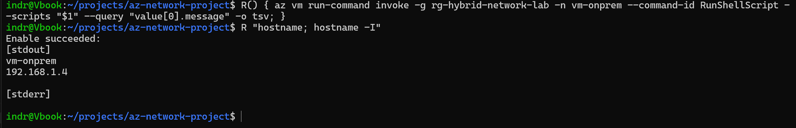

# Validation

Evidence that each phase works, captured as it was run. One file per phase.

| Phase | Record | What it establishes |
|---|---|---|
| 0 | [phase-0-pipeline.md](phase-0-pipeline.md) | The pipeline applies instead of silently skipping |
| 1 | [phase-1-tunnel.md](phase-1-tunnel.md) | The topology deploys and tears down from the pipeline |
| 2 | [phase-2-connectivity.md](phase-2-connectivity.md) | Traffic crosses the tunnel and the NSGs are scoped |

Phases 3 to 5 are not built yet. See [plan.md](../../plan.md).

---

## How the checks work

Two kinds, and both are needed.

**Control plane.** `az network watcher` asks Azure what it *would* do with a given flow, and names the rule or route that decides. No packets, no agent, and it explains *why*, which a failed ping never does.

**Data plane.** Commands run on the VMs. Slower and less specific, but it is the only thing that proves the path actually carries traffic rather than merely being configured to.

A check that passes on one and fails on the other is the interesting case. That is how the Phase 2 Bastion problem was found: the rules said Allow, the connection still failed, and the gap between them was the routing.

## Re-running the suite

Needs `az login` with an account that can read the resource group. All read-only apart from `run-command`, which executes diagnostics on the VM.

```bash
RG=rg-hybrid-network-lab; SPOKE=10.1.0.4; ONPREM=192.168.1.4; BASTION=10.0.2.4; HUBGW=10.0.0.4
```

**Tunnel status**

```bash
for c in conn-onprem-to-hub conn-hub-to-onprem; do printf '%-22s %s\n' "$c" "$(az network vpn-connection show -n $c -g $RG --query connectionStatus -o tsv)"; done
```

**Effective route, both directions**

```bash
az network watcher show-next-hop -g $RG --vm vm-spoke --source-ip $SPOKE --dest-ip $ONPREM -o json
```

**NSG matrix**

```bash
t(){ printf '%-46s %s\n' "$1" "$(az network watcher test-ip-flow -g $RG --vm $2 --direction $3 --protocol TCP --local $4 --remote $5 --query '[access,ruleName]' -o tsv | tr '\n\t' '  ' | sed 's#securityRules/##g')"; }
```

Then one line per assertion, listed in [phase-2-connectivity.md](phase-2-connectivity.md).

**Commands on the on-premises VM**, which Bastion cannot reach:

```bash
R(){ az vm run-command invoke -g $RG -n vm-onprem --command-id RunShellScript --scripts "$1" --query "value[0].message" -o tsv; }
```


