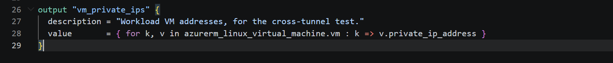
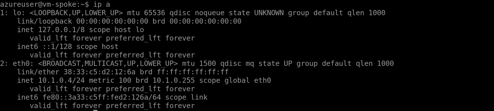
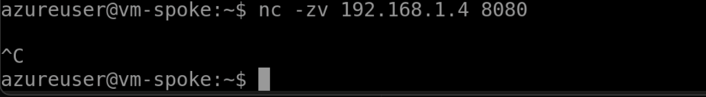
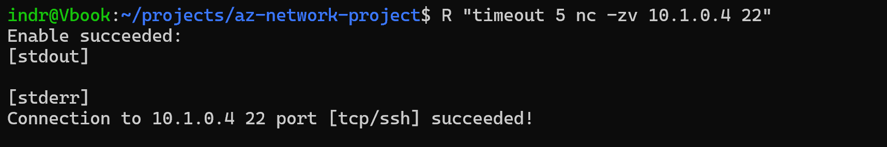
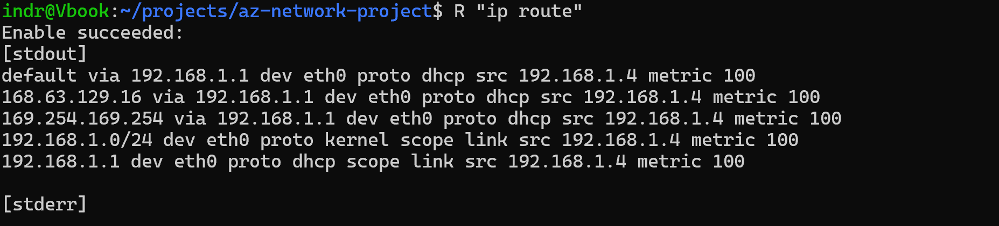
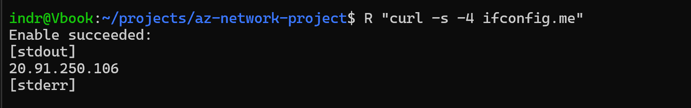

# Phase 2 validation: connectivity and NSGs

1 VM in the spoke vnet, 1 in the "on-prem" vnet.

| Check | Result |
|---|---|
| Tunnel carries ICMP, spoke to on-prem | Pass |
| Gateway transit, both directions | Pass |
| NSG matrix, 11 assertions | Pass |
| TCP 22 open, 8080 blocked, from the wire | Pass |
| Reverse direction, on-prem to spoke | Pass |
| Egress and DNS baselines captured | Recorded |

---

## Deployed




> `vm-spoke` at `10.1.0.4`, `vm-onprem` at `192.168.1.4`.

Compute is opt-in per run rather than committed to the repo:


---

## A packet crosses the tunnel

```bash
hostname && hostname -I && ping -c 3 192.168.1.4
```


> **Pass.** 0% loss. First real traffic in the project. RTT 2.8 to 59 ms, variable because burstable VMs and an IPsec tunnel both add jitter.

The VM's own view of the network shows nothing unusual, which is the point:



---

## Gateway transit

```bash
az network watcher show-next-hop -g $RG --vm vm-spoke --source-ip 10.1.0.4 --dest-ip 192.168.1.4
```

```json
{ "nextHopType": "VirtualNetworkGateway", "routeTableId": "Gateway Route" }
```

> **Pass.** The spoke has no gateway of its own and routes through the hub's. Symmetric in the reverse direction.

**Baseline for Phase 3.** After the firewall and its UDRs, this must read `VirtualAppliance` with the firewall's private IP. If it still says `VirtualNetworkGateway`, the route table is not taking effect and the firewall is being bypassed while appearing to work.

---

## NSG matrix

Eleven assertions through `test-ip-flow`, which names the rule that decided.


| Flow | Result | Rule |
|---|---|---|
| spoke:22 from bastion subnet | Allow | `allow-ssh-from-bastion` |
| spoke:22 from on-prem | Allow | `allow-ssh-from-onprem` |
| spoke:22 from hub gateway subnet | Deny | `deny-all-inbound` |
| spoke:22 from internet | Deny | `deny-all-inbound` |
| spoke:3389 from on-prem | Deny | `deny-all-inbound` |
| spoke:80 from on-prem | Deny | `deny-all-inbound` |
| onprem:22 from spoke | Allow | `allow-ssh-from-spoke` |
| onprem:22 from bastion subnet | Deny | `deny-all-inbound` |
| onprem:22 from internet | Deny | `deny-all-inbound` |
| spoke to internet:443 | Allow | `AllowInternetOutBound` |
| onprem to internet:443 | Allow | `AllowInternetOutBound` |

> **Row 3 is the one that matters.** Azure's default `AllowVnetInBound` would have permitted SSH from the hub gateway subnet. It came back Deny, so the rule at priority 4096 is genuinely overriding the platform default rather than sitting there decoratively.

> **Row 8 explains a later problem.** Bastion could not reach `vm-onprem`. Adding an allow rule made this row pass and the connection still failed, which is how the real cause was found. See [troubleshooting item 10](../troubleshooting.md#10-bastion-cannot-reach-the-on-premises-vnet).

> **The last two rows are the gap.** Egress is unrestricted because no outbound rules were written. Phase 3 closes it.

---

## The same conclusions from the wire

```bash
nc -zv 192.168.1.4 22
nc -zv 192.168.1.4 8080
```




> **Pass.** Allowed port connects, denied port hangs rather than refusing. A hang means packets are being dropped silently, which is what an NSG deny looks like from the client.

---

## Reverse direction

Bastion cannot reach `vm-onprem`, so these run through the Azure agent.



> **Pass.** On-prem reaches the spoke on 22, allowed by `allow-ssh-from-onprem`.

```bash
R "ip route"
```



> The VM has no idea a tunnel exists. One default route to the subnet gateway; Azure does all the routing below it. Worth remembering when debugging, because nothing inside the guest will ever reveal a routing problem.

---

## Baselines for later phases



> Both VMs currently leave via Azure's default SNAT. After Phase 3 this should be the firewall's public IP, and `curl ifconfig.me` becomes a one-command proof that routing changed.

DNS on both VNets resolves through `168.63.129.16`, Azure's platform resolver. Phase 5 replaces that with the DNS Private Resolver inbound endpoint.
