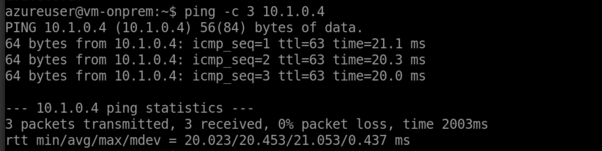
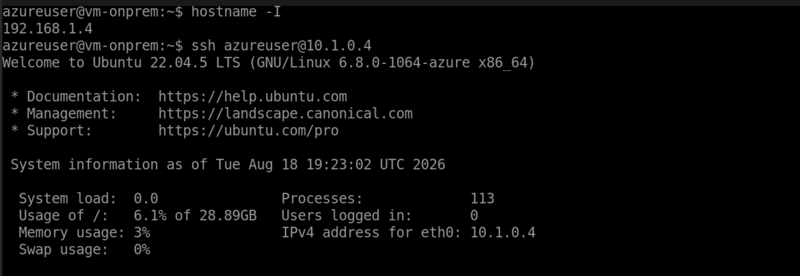
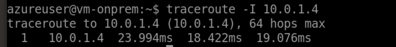
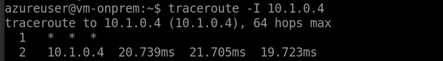
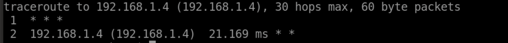
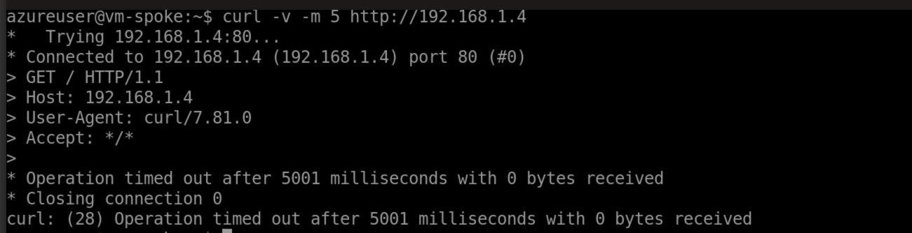

# Phase 3 validation: forced routing and Azure Firewall

Phase 3 inserts Azure Firewall into the path between the spoke and the simulated on-premises network. The evidence below shows that ICMP and SSH remain reachable after the UDRs are activated, while application-rule logs prove that HTTP traffic traverses the firewall and receives the configured allow or default-deny decision.

| Check | Result |
|---|---|
| Azure Firewall Standard and policy deployed | Pass |
| Spoke and gateway UDRs define the symmetric path through the firewall | Pass (configuration) |
| ICMP crosses from on-prem to spoke | Pass |
| SSH crosses from on-prem to spoke | Pass |
| Unmatched HTTP from on-prem to spoke is denied | Pass |
| Firewall application-rule decisions appear in Log Analytics | Pass |
| Apparent open ports 80/443 explained with application-layer evidence | Resolved |

---

## Deployed controls

The hub contains Azure Firewall Standard at `10.0.1.4`, a Standard firewall policy, a public IP, and a Log Analytics workspace. Its cross-premises network-rule collection explicitly allows ICMP and SSH. A separate, directional application-rule collection permits HTTP and HTTPS from the spoke.


The network-rule collection uses both address ranges in both its source and destination lists. That compact definition matches the intended cross-premises flows, but it is a cross-product: traffic within either range could also match if routing ever sent it to the firewall. Separate directional rules would be tighter in a production policy.

Two route tables make the inspection path symmetric:

- `rt-spoke-workloads` sends `192.168.0.0/16` and `0.0.0.0/0` to `10.0.1.4`.
- `rt-hub-gateway` sends `10.1.0.0/16` to `10.0.1.4` on traffic returning from the VPN gateway.
- BGP propagation is disabled on the spoke route table so the gateway-learned route cannot bypass the firewall.

The firewall and routing modules are gated together by `deploy_firewall`, preventing a route table from pointing at a firewall that does not exist.

---

## Allowed cross-premises traffic

```bash
ping -c 3 10.1.0.4
```



> **Pass for reachability.** ICMP remains available after forced routing, and the configuration contains the corresponding `cross-premises/icmp` allow rule. The captured evidence does not include an `AZFWNetworkRule` log row tying this individual ping to that named rule.

```bash
ssh azureuser@10.1.0.4
```



> **Pass for reachability.** TCP/22 remains available after the UDRs are activated and is admitted by the spoke NSG. The configuration contains the corresponding firewall allow rule, but the captured evidence does not include an `AZFWNetworkRule` log row for this SSH session.

---

## Path evidence

The firewall is reachable as the first routed hop from the simulated on-premises VM:



The end-to-end traces show the destination on the second hop in both directions. Azure Firewall does not return every traceroute probe, so the inspection hop appears as `* * *` rather than identifying itself.





For the captured application tests, the decisive evidence is the firewall log: it records the real source and destination addresses and the exact rule or default behavior that handled each HTTP or HTTPS request. A direct peering or gateway path would not produce these records.

---

## Why ports 80 and 443 appeared open

The first `nmap` scan appeared to show TCP/80 and TCP/443 open even though neither VM runs a web service and the NSGs do not allow those ports.


`nc` reproduced the TCP handshake result:


That result is not proof of end-to-end application access. Azure Firewall performs application-layer processing and can complete or intercept the TCP connection before it makes a final HTTP or TLS decision.

An HTTP request exposes the real policy result:

```bash
curl -v -m 5 http://10.1.0.4
```


> **Pass.** Azure Firewall returns HTTP status `470` with `Action: Deny` and `Reason: No rule matched`. The on-premises range is not included in the `spoke-egress` application rule, so HTTP to the spoke is denied by default.

Raw-IP HTTPS tests are also misleading for application rules. A request such as `https://192.168.1.4` has no usable hostname for SNI matching. The firewall log therefore records `SNI TLS extension was missing`; a TLS decode error is not evidence that an HTTPS service is reachable.

---

## Layered enforcement

The spoke application rule permits HTTP/HTTPS egress from `10.1.0.0/16`, but the destination still has to admit the traffic. An HTTP request from `vm-spoke` to `vm-onprem` establishes a connection and then times out:



The firewall log records the HTTP request as `Allow` under `rcg-lab / spoke-egress / web`. The subsequent timeout is consistent with the on-premises workload NSG's explicit inbound deny, illustrating that a firewall allow does not override downstream policy. The captured evidence does not independently identify that NSG as the component that dropped this packet.

---

## Log Analytics evidence


The captured results show three distinct decisions:

- `192.168.1.4 -> 10.1.0.4:80`: **Deny**, default behavior, no rule matched.
- `10.1.0.4 -> 192.168.1.4:80`: **Allow**, policy `fwp-hub`, collection `spoke-egress`, rule `web`; the request then times out, consistently with the destination NSG policy.
- HTTPS requests made directly to an IP address: **Deny**, SNI TLS extension missing.

This resolves the apparent discrepancy between `nmap`/`nc` and the intended policy. TCP connection establishment alone was the wrong test; the application response and firewall logs are authoritative.

---

## Result and remaining limitation

Phase 3 is complete. The UDRs define a symmetric inspection path, ICMP and SSH remain reachable after route activation, unmatched HTTP is denied, and application-rule logs identify the firewall decisions for the captured HTTP and HTTPS tests.

The `spoke-egress` application rule currently uses `destination_fqdns = ["*"]` so package updates and test requests work. That is deliberately permissive lab egress, not a production allowlist. A later hardening pass should replace it with the required FQDNs.
