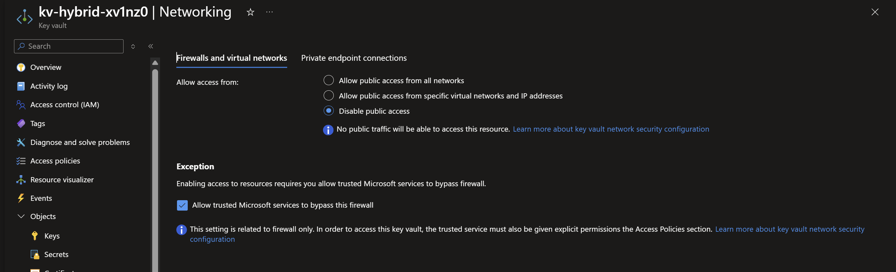
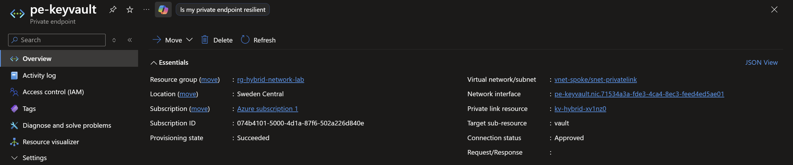
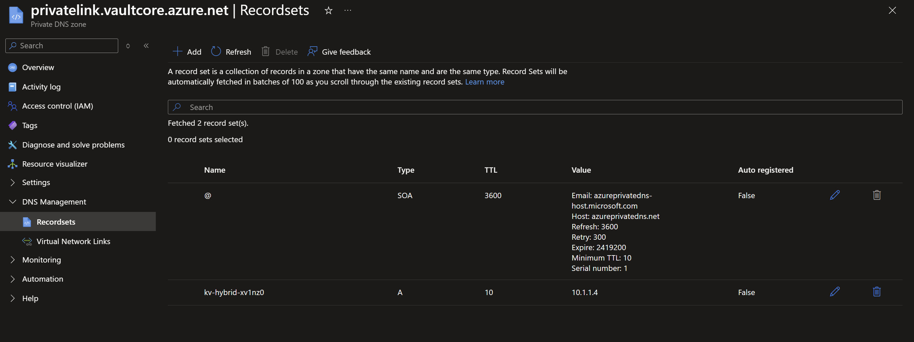
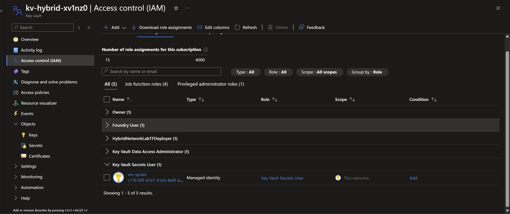
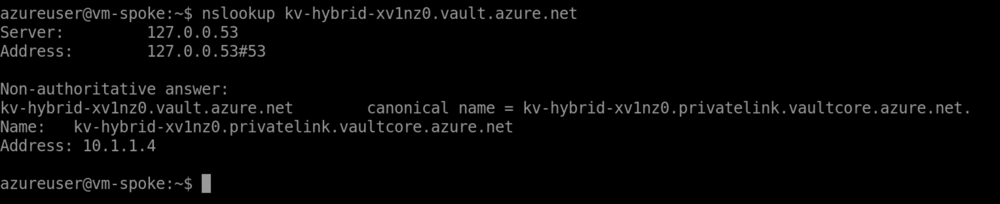
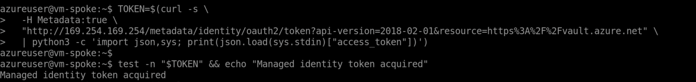
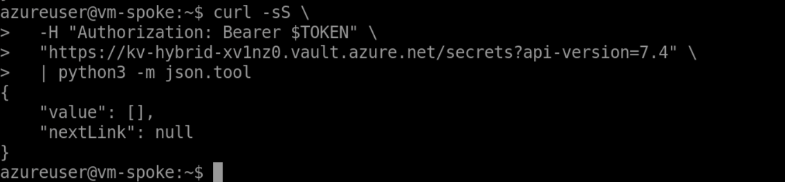
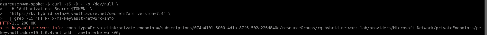

# Phase 4 validation: Private Link and Key Vault

Phase 4 moves Key Vault access off the public data plane. The vault is reachable from the spoke VM
through a private endpoint, and the VM authenticates with its system-assigned managed identity.

**Result:** complete. The endpoint is approved at `10.1.1.4`, the public endpoint is disabled,
private DNS resolves correctly in the spoke, and an authenticated Key Vault request succeeds over
Private Link.

## What was deployed

| Component | Deployed state |
|---|---|
| Key Vault | `kv-hybrid-xv1nz0`, RBAC authorization, purge protection, public network access disabled |
| Private endpoint | `pe-keyvault` in `vnet-spoke/snet-privatelink`, connection approved |
| Private address | `10.1.1.4` |
| Private DNS zone | `privatelink.vaultcore.azure.net` with an A record for the vault |
| Workload identity | System-assigned managed identity on `vm-spoke` |
| Data-plane access | `Key Vault Secrets User` assigned to `vm-spoke` at vault scope |

Terraform deliberately does not create or read a secret. A GitHub-hosted runner is outside the
private network, and a private-only vault should not be made public just to seed test data. The
successful empty secret-list response proves network reachability, token validity, and RBAC without
placing a Key Vault demo secret in Terraform configuration or state. The separate VPN pre-shared
key remains in protected state as described in the project decisions.

## Control-plane validation

### Public access is disabled

The Key Vault networking blade shows **Disable public access** selected.



### The private endpoint is healthy

The private endpoint is attached to `vnet-spoke/snet-privatelink`, targets the vault subresource,
has provisioning state `Succeeded`, and connection status `Approved`.



### Private DNS points to the endpoint

The private zone contains `kv-hybrid-xv1nz0` as an A record with value `10.1.1.4`.



### The VM has the intended role

At Key Vault scope, `vm-spoke` has the built-in `Key Vault Secrets User` role as a managed identity.
The same view records the deployment identity's bootstrap authorization used to create that
assignment.



### The deployment completed

After the private secret resource was removed and the workload role assignment was added, the
manually triggered Terraform deployment completed successfully.


## Data-plane validation from `vm-spoke`

### 1. Resolve the public vault name privately

```bash
nslookup kv-hybrid-xv1nz0.vault.azure.net
```

The public name aliases to `kv-hybrid-xv1nz0.privatelink.vaultcore.azure.net`, which resolves to
`10.1.1.4`.



### 2. Acquire a managed-identity token

```bash
TOKEN=$(curl -s \
  -H Metadata:true \
  "http://169.254.169.254/metadata/identity/oauth2/token?api-version=2018-02-01&resource=https%3A%2F%2Fvault.azure.net" \
  | python3 -c 'import json,sys; print(json.load(sys.stdin)["access_token"])')
test -n "$TOKEN" && echo "Managed identity token acquired"
```



### 3. Prove the negative RBAC case

Before the role assignment existed, the same token reached Key Vault but received
`ForbiddenByRbac` with `Assignment: (not found)`. This separated network success from authorization
failure.


### 4. Repeat after the Terraform-managed role assignment

```bash
curl -sS \
  -H "Authorization: Bearer $TOKEN" \
  "https://kv-hybrid-xv1nz0.vault.azure.net/secrets?api-version=7.4" \
  | python3 -m json.tool
```

The service returns a successful JSON response with an empty `value` list. Empty is expected because
Terraform no longer seeds a secret; the important result is that the response is not an error.



### 5. Prove the transport used Private Link

```bash
curl -sS -D - -o /dev/null \
  -H "Authorization: Bearer $TOKEN" \
  "https://kv-hybrid-xv1nz0.vault.azure.net/secrets?api-version=7.4" \
  | grep -Ei 'HTTP/|x-ms-keyvault-network-info'
```

The response is `HTTP/1.1 200 OK`. The `x-ms-keyvault-network-info` header includes
`conn_type=PrivateLink`, names `pe-keyvault`, and reports the VM source address `10.1.0.4`.



## Acceptance matrix

| Assertion | Expected | Observed | Result |
|---|---|---|---|
| Public Key Vault data-plane access | Disabled | Portal shows disabled | Pass |
| Private endpoint provisioning | Succeeded | `pe-keyvault` succeeded | Pass |
| Private endpoint connection | Approved | Portal shows approved | Pass |
| Vault DNS from spoke | `10.1.1.4` | `nslookup` returns `10.1.1.4` | Pass |
| VM identity token | Non-empty | IMDS token acquired | Pass |
| Missing RBAC is enforced | `ForbiddenByRbac` | Denied before assignment | Pass |
| Vault request after RBAC | HTTP 200 | Empty secret list returned | Pass |
| Network path | Private Link | Header reports `conn_type=PrivateLink` | Pass |

## Phase boundary

Phase 5 removed the temporary direct private-zone link to `vnet-onprem` before recording its
negative baseline. The later on-premises private resolution is therefore attributable to Azure DNS
Private Resolver rather than a Phase 4 shortcut. See
[the Phase 5 validation](phase-5-dns-resolver.md).
