# Phase 5 validation: Azure DNS Private Resolver

Phase 5 replaces direct cross-boundary private-zone linking with an explicit hybrid DNS path. The
simulated datacenter sends Azure private-name queries to a resolver inbound endpoint, while Azure
workloads send `corp.internal` queries through a forwarding ruleset and resolver outbound endpoint
to the on-premises DNS server.

**Result:** complete. Both resolution directions pass, and the negative baselines show that neither
answer existed through the demonstrated path before the resolver was deployed. The target listens
on both DNS transports; the captured TCP query proves the client-to-stub leg only, not that the
resolver-to-target leg selected TCP.

## Deployed path

| Component | Deployed state |
|---|---|
| Private Resolver | `dnspr-hub` in `vnet-hub`, Sweden Central |
| Inbound endpoint | `inbound`, static address `10.0.3.4`, subnet `snet-dns-inbound` |
| Outbound endpoint | `outbound`, subnet `snet-dns-outbound` |
| Forwarding ruleset | `ruleset-hub`, linked to hub and spoke |
| Forwarding rule | `corp.internal.` to `192.168.1.4:53` |
| On-premises DNS | `dnsmasq` on `vm-onprem`, serving the local lab record |
| Test record | `app.corp.internal` -> `192.168.1.4` |
| Transport control | UDP/53 and TCP/53 allowed only from `10.0.3.16/28` to the on-premises workload subnet |

The two tested paths are:

```text
vm-onprem -> 10.0.3.4 inbound endpoint -> Azure Private DNS -> Key Vault PE 10.1.1.4

vm-spoke -> Azure-provided DNS -> ruleset-hub -> outbound endpoint
         -> IPsec tunnel -> dnsmasq 192.168.1.4 -> app.corp.internal
```

Azure documents the endpoint and ruleset behavior in
[Azure DNS Private Resolver endpoints and rulesets](https://learn.microsoft.com/en-us/azure/dns/private-resolver-endpoints-rulesets).

## Negative baselines

The negative tests were captured after removing the direct `vnet-onprem` link from the Key Vault
private DNS zone and before enabling the resolver.

### On-premises did not receive the Key Vault private address

`resolvectl` showed `168.63.129.16`, Azure's platform virtual IP, as the VM's upstream DNS server.
The local `127.0.0.53` address shown by lookup tools is the Ubuntu `systemd-resolved` stub, not the
upstream server.

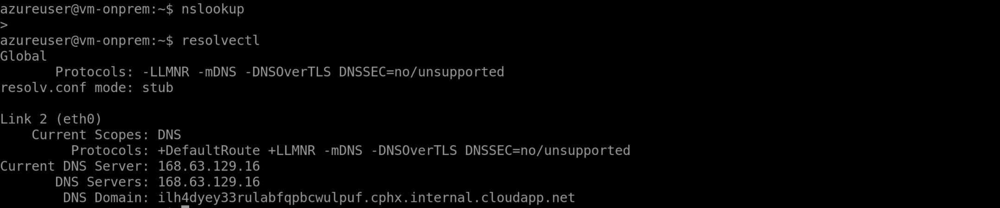

```bash
nslookup kv-hybrid-5v81m9.vault.azure.net
```

The response followed the public Key Vault chain and returned public `51.12.*` addresses instead of
private endpoint `10.1.1.4`.

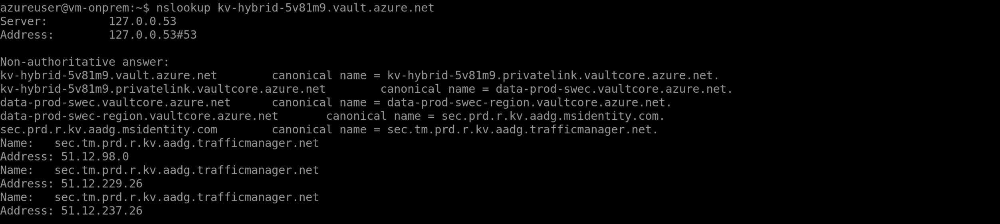

### The spoke did not know the on-premises namespace

```bash
nslookup app.corp.internal 168.63.129.16
```

Azure-provided DNS returned `NXDOMAIN`. There was no forwarding rule for the private namespace.

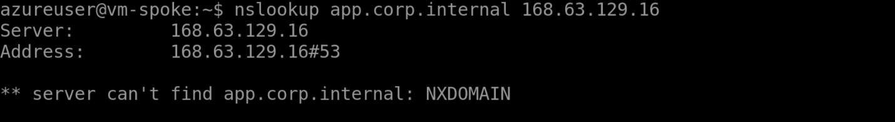

## Deployment and control-plane validation

The manual workflow kept the workload, firewall, and Private Link phases enabled and added the DNS
phase. Terraform completed with seven resources added, three changed, and none destroyed.


The inbound endpoint has the expected stable address and delegated subnet.

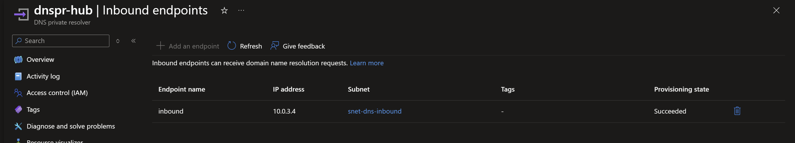

The outbound endpoint is associated with `ruleset-hub` and its dedicated subnet.

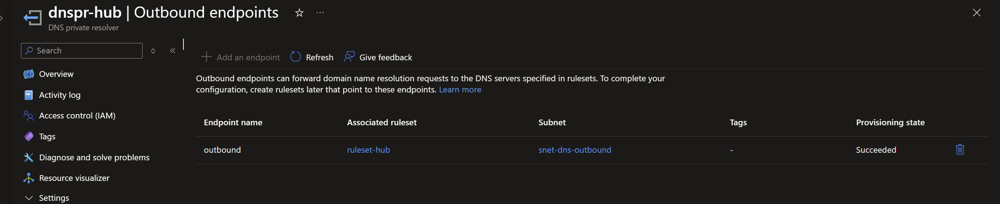

## Inbound validation: on-premises to Azure private DNS

After the on-premises VM was restarted to renew its DHCP-provided DNS configuration,
`resolvectl` showed `10.0.3.4` as the actual upstream server.

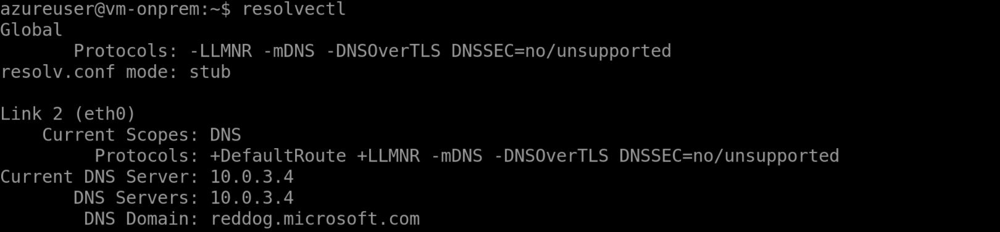

```bash
nslookup kv-hybrid-5v81m9.vault.azure.net
```

The ordinary lookup through the local Ubuntu stub followed the Private Link alias and returned
`10.1.1.4`.

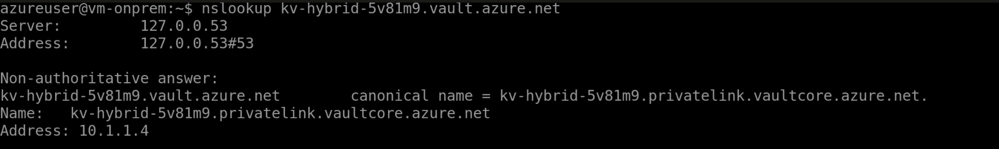

An unauthenticated HTTPS request returned HTTP `401`, which is expected, and reported the remote IP
as `10.1.1.4`. This separates private transport from application authorization.

```bash
curl -sS -o /dev/null \
  -w 'HTTP=%{http_code} REMOTE_IP=%{remote_ip}\n' \
  'https://kv-hybrid-5v81m9.vault.azure.net/secrets?api-version=7.4'
```

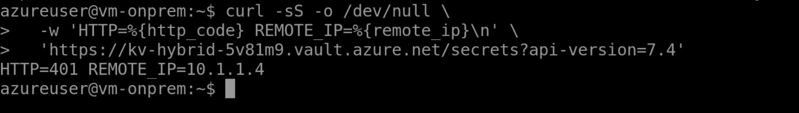

## Outbound validation: Azure to the on-premises namespace

The on-premises server listens on its workload address for both DNS transports. Binding only to
`192.168.1.4` lets `systemd-resolved` continue using `127.0.0.53` without a port collision.

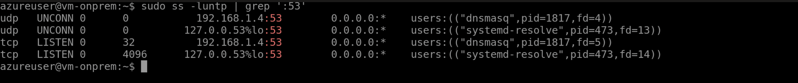

From `vm-spoke` at `10.1.0.4`, the ordinary lookup returned the record served by `vm-onprem`:

```bash
nslookup app.corp.internal
```

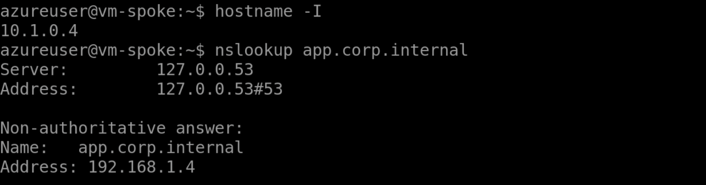

DNS normally starts with UDP, while large or truncated responses can retry over TCP. This command
forces TCP between `dig` and Ubuntu's local `systemd-resolved` stub:

```bash
dig +tcp app.corp.internal +short
```

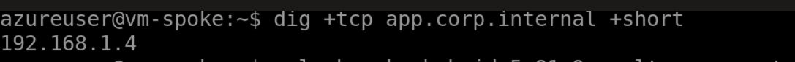

The result confirms the local stub accepts TCP. Separately, the socket capture shows `dnsmasq`
listening on remote TCP/53 and Terraform permits TCP/53 from the outbound subnet. It does **not**
prove that this forwarded query used TCP between the resolver and `dnsmasq`; that leg was not
independently captured.

## Evidence boundary for the Terraform hardening

The screenshots validate the live configuration after its manual repair. The Terraform source was
updated afterward to generate the same scoped `dnsmasq` configuration, to install the package from
a bounded retry loop, and to hold VM creation until the tunnel exists via
`depends_on = [module.connectivity]`.
That source change is not part of the pictured seven-add, three-change apply. Because changing VM
`custom_data` can require replacement, the next authenticated plan must be reviewed and the smoke
tests repeated before calling the rebuild path validated.

### Optional query trace

`dnsmasq` query logging is intentionally not left enabled because routine DNS logs can expose every
hostname clients request. For a short diagnostic window, add `log-queries=extra`, restart the
service, issue one lookup from the spoke, and inspect the service journal. Remove the setting when
the trace is complete.

```bash
# vm-onprem: enable briefly
echo 'log-queries=extra' | sudo tee /etc/dnsmasq.d/validation-log.conf
sudo systemctl restart dnsmasq

# vm-spoke: generate one traceable request
nslookup app.corp.internal

# vm-onprem: inspect and then disable
sudo journalctl -u dnsmasq --since '5 minutes ago' --no-pager
sudo rm /etc/dnsmasq.d/validation-log.conf
sudo systemctl restart dnsmasq
```

## Acceptance matrix

| Assertion | Expected | Observed | Result |
|---|---|---|---|
| Direct private-zone shortcut | Removed | On-premises baseline returned public vault addresses | Pass |
| Pre-resolver on-premises namespace | Unknown from spoke | Azure DNS returned `NXDOMAIN` | Pass |
| Resolver provisioning | Connected and succeeded | Portal shows connected/succeeded | Pass |
| Inbound endpoint | Static `10.0.3.4` | Portal and `resolvectl` show `10.0.3.4` | Pass |
| On-premises vault resolution | Private endpoint `10.1.1.4` | Normal lookup returns `10.1.1.4` | Pass |
| On-premises vault transport | Connect to private endpoint | `curl` reports remote IP `10.1.1.4` | Pass |
| On-premises DNS listener | UDP and TCP on `192.168.1.4:53` | Both sockets owned by `dnsmasq` | Pass |
| Spoke `corp.internal` resolution | `192.168.1.4` | Normal lookup returns `192.168.1.4` | Pass |
| Client-to-stub DNS over TCP | Local stub returns the record | `dig +tcp` returns `192.168.1.4` | Pass |
| Resolver-to-target DNS over TCP | Not asserted by current capture | Listener and NSG are ready; forwarded transport not captured | Not tested |

## Re-run commands

Run these after a deployment or DNS-related change:

```bash
# vm-onprem
resolvectl status
nslookup kv-hybrid-5v81m9.vault.azure.net
curl -sS -o /dev/null -w 'HTTP=%{http_code} REMOTE_IP=%{remote_ip}\n' \
  'https://kv-hybrid-5v81m9.vault.azure.net/secrets?api-version=7.4'
sudo ss -luntp | grep ':53'

# vm-spoke
nslookup app.corp.internal
dig +tcp app.corp.internal +short
```

If the outbound lookup times out, start at the target server: confirm `dnsmasq` exists,
listens on `192.168.1.4:53`, and answers locally before investigating the resolver, NSG, firewall,
or tunnel. The failures found during this validation are recorded in
[troubleshooting.md](../troubleshooting.md#phase-5-azure-dns-private-resolver).
