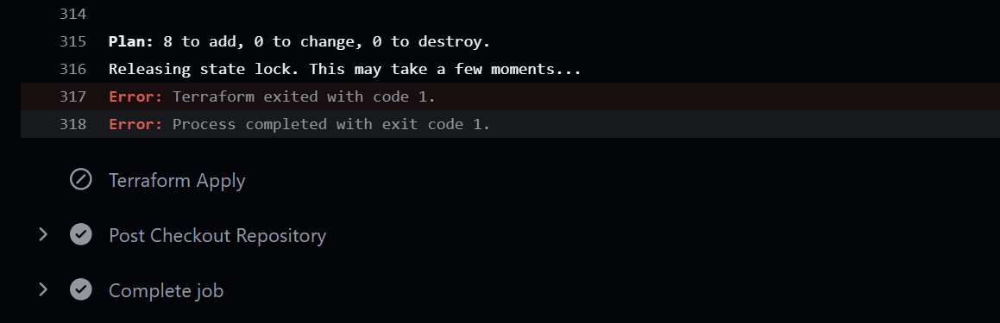

# Work log

What was built, in the order it was built, and what changed along the way.

This is a build journal rather than a changelog. The reasoning behind the choices lives in [decisions.md](decisions.md), and the errors are written up properly in [troubleshooting.md](troubleshooting.md). This file is the narrative that connects them.

Entries are in the order the work actually happened, which is why Phase 0 appears after Phase 1: it was written as a roadmap of fixes only once Phase 1 had been built and its rough edges were visible.

---

## Phase 1: S2S tunnel foundation

Getting a hub-and-spoke topology plus a simulated on-premises site deployed and connected, from a pipeline with no stored credentials. Five stages, the third of which was almost entirely fighting Azure.

### Stage 1: Define the network

**Goal:** get a hub-and-spoke topology plus a simulated on-premises site described in Terraform, with as little repetition as possible.

Started with the address plan rather than with resources. Three non-overlapping ranges, chosen so the on-premises side looks nothing like the Azure side:

- `192.168.0.0/16` for the simulated datacenter
- `10.0.0.0/16` for the hub
- `10.1.0.0/16` for the spoke

Non-overlapping matters here specifically. A tunnel and a peering both carry routes into the same route tables, so overlapping ranges would produce a network that either fails to build or, worse, builds and routes traffic somewhere unexpected.

That address plan went straight into `terraform/locals.tf` as a nested map rather than into a comment. Everything else loops over it. Two resource blocks, `azurerm_virtual_network` and `azurerm_subnet`, produce all three VNets and all six subnets, with `flatten()` bridging the gap between the nested map and what `for_each` can consume. The full explanation is in [terraform-patterns.md](terraform-patterns.md).

Then the connectivity, in `terraform/main.tf`:

- Two VPN gateways, one in each `GatewaySubnet`, with a public IP each
- Two gateway connections pointing at each other, forming one bidirectional tunnel
- Two peerings between hub and spoke, with `allow_gateway_transit` on the hub side and `use_remote_gateways` on the spoke side

The peering pair is where the hub-and-spoke value actually lives. Those two flags are what let the spoke reach the on-premises range through the hub's gateway without needing a gateway of its own. The spoke peering carries an explicit `depends_on` for the hub gateway, because Azure will not accept `use_remote_gateways` pointing at a gateway that does not exist yet.

`AzureFirewallSubnet` and `AzureBastionSubnet` were carved out at this point even though nothing was going to occupy them. Both services demand those exact subnet names and a minimum size, so reserving the space early avoids renegotiating the address plan later.

**End state:** a config that describes the whole network. Not yet deployed, and not yet deployable, because there was no way to authenticate.

---

### Stage 2: Bootstrap identity and state

**Goal:** let GitHub Actions deploy into Azure without storing an Azure credential anywhere.

`scripts/bootstrap-azure.sh` handles the one-time setup, and it is written to be idempotent so it can be re-run without duplicating anything. In order, it:

1. Reads the subscription and tenant ID from the active `az` session
2. Creates a custom RBAC role, `HybridNetworkLabTFDeployer`, or updates it if present
3. Creates an app registration and service principal, then assigns that role at subscription scope
4. Adds two federated credentials trusting GitHub's OIDC issuer, one for `main` and one for pull requests
5. Creates a resource group, a storage account with a random suffix, and a `tfstate` container
6. Prints the values to paste into GitHub secrets

The custom role instead of Contributor was deliberate. The point is not that it is minimal, because it grants provider-level wildcards and is not minimal. The point is that it cannot create role assignments, so a compromised pipeline cannot widen its own access. That is the property worth having, and calling it least-privilege would be overstating what it does. See [decisions.md](decisions.md#4-why-a-custom-rbac-role-instead-of-contributor).

The storage account name gets a random hex suffix because storage account names are globally unique across all of Azure. That also means it cannot be hardcoded in `backend.tf`, which is part of why the backend is partially configured: only the container name and blob key live in the repo, and the resource group and account name arrive as `-backend-config` flags at init time.

On the GitHub side that produced two federated credentials in the app registration, one per trusted subject:

And the identifiers the script printed went into repository secrets. First the four Azure and state values:

Then `VPN_SHARED_KEY`, which is the only one of the six that is an actual secret rather than an identifier:

The workflow reads all of them through its `env` block. `ARM_USE_OIDC: true` is what tells the AzureRM provider to use the federated token instead of looking for a client secret, and the `TF_VAR_` prefix is what turns a GitHub secret into a Terraform variable without it ever appearing on a command line:

**End state:** OIDC trust configured, state storage ready, six GitHub secrets set.

---

### Stage 3: Build the pipeline, then fight it

**Goal:** deploy from GitHub Actions.

`.github/workflows/terraform-apply.yml` was straightforward to write and considerably less straightforward to get working. What followed was six distinct failures, most of them Azure platform changes rather than mistakes in the config.

The order they surfaced in:

**Runs hung at `terraform init`.** Two commits pushed in quick succession produced two runs racing for the same state lock. No error, just a run counting upwards. Fixed by cancelling the stuck runs and adding an explicit `azure/login@v2` step before init, so that authentication failures would at least look different from backend hangs. [Details](troubleshooting.md#1-terraform-init-hangs-forever).

**`AADSTS700213` on login.** The federated credential's subject did not match what GitHub sent. GitHub has moved to immutable subject claims that embed numeric owner and repository IDs, and the credential had been created with the older name-based format. Fixed by copying the exact subject out of the error message into the portal. The bootstrap script still writes the old format and needs updating. [Details](troubleshooting.md#2-oidc-subject-mismatch-aadsts700213).

**`IPv4BasicSkuPublicIpCountLimitReached`.** The provider was defaulting to Basic SKU public IPs, which Azure no longer creates. Fixed by setting `sku = "Standard"` and `allocation_method = "Static"` explicitly. [Details](troubleshooting.md#3-basic-sku-public-ip-blocked).

**`terraform fmt -check` exit code 3.** Formatting drift plus non-breaking space characters that came in with pasted code. Invisible in the editor, not invisible to `fmt`. [Details](troubleshooting.md#4-terraform-fmt--check-exits-3).

**`NonAzSkusNotAllowedForVPNGateway`.** Azure retired non-AZ gateway SKUs. `VpnGw1` became `VpnGw1AZ` on both gateways. [Details](troubleshooting.md#5-non-az-gateway-sku-rejected).

**`VmssVpnGatewayPublicIpsMustHaveZonesConfigured`.** Direct consequence of the previous fix: an AZ gateway requires its Standard public IP to declare zones. Added `zones = ["1", "2", "3"]`. [Details](troubleshooting.md#6-az-gateway-requires-zoned-public-ip).

The last three are worth reading as one thing rather than three. Fixing the Basic SKU issue produced a Standard IP, fixing the gateway SKU made it zone-redundant, and the combination triggered a third requirement that neither change implied by itself. Three applies to get through what was really one platform-modernisation change.

With all six fixed, the plan went through and the apply started building:

Something else the delay made obvious: gateways are slow. The full run took just under 22 minutes, almost all of it waiting on the two gateways, and the connections cannot come up until both are finished. Every failed apply in this phase cost that same waiting time, which is a strong argument for catching what you can before reaching Azure at all.

And the resources in the portal, which is the first point at which the diagram and reality could be compared:

That listing is also where `pip-vpn-spoke` becomes visible as a problem. It is sitting there next to the two that are actually attached to gateways, and nothing uses it.

Comparing the two screenshots explains where it came from. The plan says 18 resources; the current config produces 19. The difference is exactly one public IP. At plan time the config created two, one per gateway, which is what the Basic SKU failure showed as well: it named `pip-vpn-hub` and `pip-vpn-onprem` and nothing else. Rewriting that resource to fix the SKU also changed it to `for_each = local.networks`, which is three entries rather than two, and the spoke picked up an IP it has no gateway to attach to.

A small thing, and it is billing for a static IP that nothing routes to. More usefully, it is a clear example of the failure mode described in [terraform-patterns.md](terraform-patterns.md#where-the-loop-is-currently-wrong): reaching for the nearest existing map rather than the one that answers the question being asked.

**End state:** the network deployed, connections reporting as Connected.

---

### Stage 4: Stop the pipeline from burning credits

**Goal:** make deployment deliberate rather than automatic.

The workflow originally ran on every push to `main`. In practice that meant any small edit, including changes that had nothing to do with infrastructure, kicked off a full run against Azure. With two VPN gateways in the config that is not a harmless mistake. It spends free trial credits, and it makes running the pipeline feel risky, which is a good way to stop committing small improvements.

The push trigger came out. What replaced it:

- `workflow_dispatch`, giving a manual Run workflow button
- `pull_request` limited by a `paths` filter to `terraform/**`, running `fmt -check` and `plan` only

The `paths` filter matters as much as the trigger change. Editing documentation now starts no pipeline at all.

The visible result is that deploying became a button rather than a side effect:

A separate `terraform-destroy.yml` was added at the same time, manual trigger only. Teardown has to be as easy as deployment or it does not happen, and an idle lab with two gateways is by far the largest cost in this project.

That screenshot was taken before it had ever been used. It has since been run, and it works. The job starts from the same manual button:

The destroy plan is the useful part, because it is the first authoritative count of what this lab actually consists of:

Nineteen, which is the first authoritative count of what the lab consists of and confirms the earlier reconstruction of the 18-versus-19 discrepancy rather than leaving it as a deduction. Teardown took roughly 17 minutes, most of it the two gateways.

**Left behind by this change:** the apply step's condition was not updated. It still reads `github.event_name == 'push'`, and push is no longer a trigger, so the step is skipped on every run while the job reports success. This has not been fixed yet. It is item 0.1 in [plan.md](../plan.md) and is written up in [troubleshooting.md](troubleshooting.md#7-apply-step-silently-skipped).

Applies are being run locally in the meantime.

**End state:** no automatic deployment, plan-on-PR review in place, teardown proven end to end, the subscription back to empty, and one known bug.

---

### Stage 5: Documentation

**Goal:** make the repository readable without running it.

Wrote this file, [decisions.md](decisions.md), [troubleshooting.md](troubleshooting.md), [terraform-patterns.md](terraform-patterns.md), [plan.md](../plan.md), and a [README](../README.md) with the architecture and the honest list of what is not built.

Documenting it turned up things that reading the code alone had not. Writing out the resource inventory made it obvious that `pip-vpn-spoke` is created and attached to nothing, because the public IP resource loops over all three networks while only two have gateways. Writing out the pipeline section is what surfaced the skipped apply step. Explaining the backend is what clarified that state is reached via an access key looked up through the management plane rather than by the service principal authenticating to blob storage directly, which in turn explains why `Microsoft.Storage/*` is in the custom role and how to remove it.

Three real findings from writing prose about working code, which is a reasonable argument for doing it.

---

## Phase 0: Prerequisites and pipeline fixes

**Goal:** clear the three bugs documentation had surfaced, and reshape the config so later phases have somewhere to land.

Done with the subscription empty, immediately after a full destroy. That timing was deliberate: changing the subnet map with resources deployed means `moved` blocks or a 45-minute gateway rebuild, and with nothing deployed it costs nothing.

**The apply step could never fire.** Its condition still required a `push` event after push had been removed as a trigger, so it was skipped on every run while the job reported success.

**Nothing stopped two runs racing for the state lock.** A shared concurrency group across both workflows makes the second run queue instead of collide. `cancel-in-progress: false` is the half that matters, since cancelling mid-apply is what leaves a stale lease.

**The two workflows disagreed on Terraform version.** Apply pinned 1.9.0, destroy took whatever `setup-terraform` defaulted to. Two versions against one state file is a problem waiting for a quiet moment.

**The subnet map could not express what later phases need.** Subnet values were bare prefix strings, which cannot carry delegation, route tables or NSGs. They became objects instead, and the same change added a `has_gateway` flag that finally removed `pip-vpn-spoke`, a public IP created and billed while attached to nothing. Composite keys were left identical, so nine subnets refreshed against their existing state addresses with nothing replaced. The full before and after is in [terraform-patterns.md](terraform-patterns.md#where-the-schema-has-to-grow-next).

**There was no `outputs.tf` at all**, so every check meant opening the portal.

The proof that Phase 0 worked is not any of the above. It is that the next manual run reached the apply step and stayed there for 24 minutes:

**End state:** 21 resources instead of 19, subnets 6 to 9, public IPs 3 to 2, and a pipeline that actually deploys when you press the button.

---

## Phase 2: Workloads, NSGs and access

**Goal:** put something in the network that can generate traffic, and prove the tunnel carries it.

Until this point the topology was believed to work because Azure reported both connections as Connected. That is a status field, not evidence.

Two Ubuntu VMs, one per workload subnet, no public IPs on either. Both gated behind a `deploy_workloads` variable so compute stays opt-in, surfaced as a checkbox on the workflow rather than a value committed to the repo:

NSGs were written alongside the VMs rather than after them, and deliberately left ungated: they cost nothing, and security configuration should not depend on whether the machines happen to be running. Each ends with an explicit deny-all at priority 4096, which is the part that matters, because Azure's default `AllowVnetInBound` otherwise permits everything arriving from a peered VNet or across the tunnel.

The SSH public key went in as a repository secret, injected as `TF_VAR_admin_ssh_public_key`:

Two failures cost a deploy cycle each, both written up in [troubleshooting.md](troubleshooting.md#phase-2-workloads-and-access):

That screenshot is also the clearest illustration of the Phase 0 bug's shape. A skipped step renders with a circle-and-slash rather than a tick, and the job around it still finishes.

Addresses came out of a new output rather than the portal:

### What the tests showed

The NSG matrix was run through `az network watcher test-ip-flow`, which evaluates the effective rules for a hypothetical flow and names the rule that matched. Eleven assertions, all as intended:

The row worth reading twice is SSH from the hub gateway subnet to the spoke, which came back `Deny deny-all-inbound`. Azure's default rules would have allowed that. It is the difference between rules that exist and rules that are scoped.

Then the same conclusions from the wire, inside a Bastion session on the spoke:

Port 22 across the tunnel succeeds, 8080 hangs and dies. The control plane says what the rules mean; the wire says what actually happens. Both were worth having.

`show-next-hop` returned `VirtualNetworkGateway` with route source `Gateway Route` in both directions, which is gateway transit confirmed: the spoke has no gateway of its own and is borrowing the hub's.

Finally the egress baseline, captured because Phase 3 changes it:

Both VMs currently leave via Azure's default SNAT. Once the firewall and its route tables are in, that address should become the firewall's, and this screenshot is what makes the difference visible.

**End state:** a packet has crossed the tunnel. NSGs proven scoped rather than merely present. Egress and DNS baselines recorded for the next two phases.

---

## Where things stand

Phases 0, 1 and 2 are complete. [plan.md](../plan.md) holds 3 through 5.

Built and proven:

- Three VNets, nine subnets, correct address plan
- Encrypted tunnel carrying real traffic between the simulated datacenter and the spoke
- Gateway transit, confirmed by effective-route lookup rather than assumed
- Subnet NSGs that override Azure's permissive defaults, confirmed rule by rule
- Bastion for private access, with no public IP on either VM
- Keyless OIDC deployment, remote state, custom RBAC role, working apply and destroy

Not built:

- Azure Firewall, and the route tables without which it would be bypassed
- Private endpoints, so there is no `privatelink` name to resolve yet
- Any DNS story: no private zones, no resolver

Known gaps:

- Egress is unrestricted in both directions, by default rather than by decision
- NSG source prefixes are `/16` where the workload subnet `/24` would be tighter
- The bootstrap script writes an OIDC subject format that no longer matches
- Bastion cannot reach the on-prem VNet, which is reached over a gateway connection rather than a peering

Next is the firewall and the routing that makes it mean anything. The single check to watch is `show-next-hop` flipping from `VirtualNetworkGateway` to `VirtualAppliance`. If it does not, the UDRs are decorative and the firewall is being bypassed, which is the most common way this pattern is got wrong.
