# Work log

What was built, in the order it was built.

Reasoning lives in [decisions.md](decisions.md), errors in [troubleshooting.md](troubleshooting.md), and test evidence in [validation/](validation/). This file is the narrative that connects them.

Phase numbering follows [plan.md](../plan.md). Entries are chronological, which is why Phase 0 appears after Phase 1: it was a list of fixes that only became visible once Phase 1 was built.

---

## Phase 1: S2S tunnel foundation

### Stage 1: Define the network

Address plan first, resources second. Three non-overlapping ranges, the on-premises one chosen to look nothing like the Azure side:

| Network | Range | Subnets |
|---|---|---|
| `vnet-onprem` | `192.168.0.0/16` | `GatewaySubnet`, `snet-onprem-workloads` |
| `vnet-hub` | `10.0.0.0/16` | `GatewaySubnet`, `AzureFirewallSubnet`, `AzureBastionSubnet` |
| `vnet-spoke` | `10.1.0.0/16` | `snet-spoke-workloads` |

Non-overlapping matters specifically here: a tunnel and a peering both push routes into the same tables, so overlap either fails to build or builds and routes traffic somewhere unexpected.

That plan went into `locals.tf` as a map, not a comment. Two resource blocks produce all three VNets and all six subnets via `flatten()`, explained in [Terraform loops and collection patterns](terraform/patterns.md).

Then two gateways, two connections pointing at each other, and hub-to-spoke peering with `allow_gateway_transit` on one side and `use_remote_gateways` on the other. Those two flags are the whole point: the spoke reaches on-prem through the hub's gateway rather than paying for its own.

The firewall and Bastion subnets were carved now despite being empty, because both services demand exact names and minimum sizes.

---

### Stage 2: Bootstrap identity and state

`scripts/bootstrap-azure.sh`, idempotent, run once.

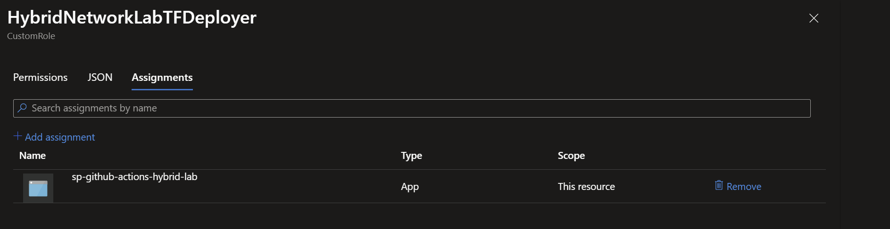

Custom role rather than Contributor. It grants provider wildcards but not unrestricted
`roleAssignments/write`, so the pipeline cannot grant itself Owner or arbitrary roles. Phase 4 later
added the separate, condition-limited `Key Vault Data Access Administrator` role, which permits only
supported Key Vault data-plane role delegation. See
[decisions.md](decisions.md#4-why-a-custom-rbac-role-instead-of-contributor).

Two trusted subjects, `main` and pull requests. No client secret anywhere.

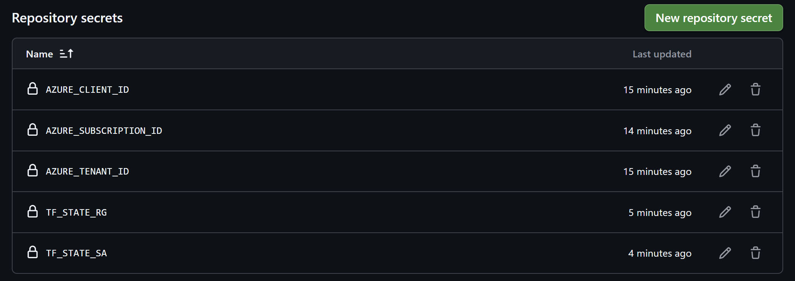

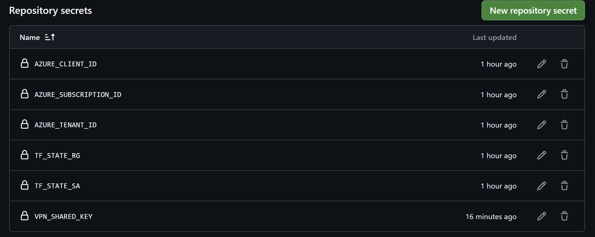

Five identifiers and one actual secret.

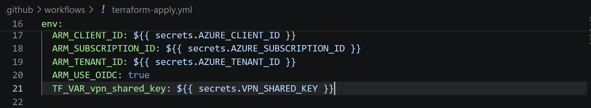

`ARM_USE_OIDC: true` is what makes the provider use the federated token. The `TF_VAR_` prefix turns a GitHub secret into a Terraform variable without it appearing on a command line.

---

### Stage 3: Build the pipeline, then fight it

Six failures between writing the workflow and getting a deployment. Four were Azure withdrawing something.

| Failure | Cause | Detail |
|---|---|---|
| `terraform init` hangs | Two runs racing the state lock | [1](troubleshooting.md#1-terraform-init-hangs-forever) |
| `AADSTS700213` | Immutable OIDC subject format | [2](troubleshooting.md#2-oidc-subject-mismatch-aadsts700213) |
| `IPv4BasicSkuPublicIpCountLimitReached` | Basic public IPs retired | [3](troubleshooting.md#3-basic-sku-public-ip-blocked) |
| `fmt -check` exit 3 | Invisible characters from pasted code | [4](troubleshooting.md#4-terraform-fmt--check-exits-3) |
| `NonAzSkusNotAllowedForVPNGateway` | Non-AZ gateway SKUs retired | [5](troubleshooting.md#5-non-az-gateway-sku-rejected) |
| `VmssVpnGatewayPublicIpsMustHaveZonesConfigured` | AZ gateways need zoned IPs | [6](troubleshooting.md#6-az-gateway-requires-zoned-public-ip) |

The last three are one cascade, not three problems. Fixing the Basic SKU produced a Standard IP, fixing the gateway SKU made it zone-redundant, and the combination triggered a third requirement neither change implied alone. Three applies for one platform-modernisation change, each costing a 20-minute gateway build.

Then it went through:

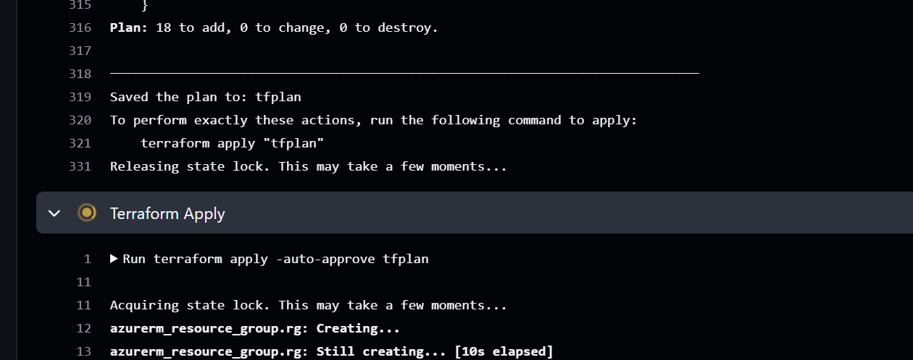

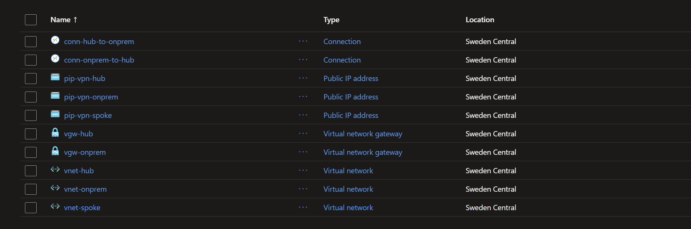

`pip-vpn-spoke` is visible there, attached to nothing. The public IP resource looped over all three networks while only two have gateways. Fixed in Phase 0.

Full record in [validation/phase-1-tunnel.md](validation/phase-1-tunnel.md).

---

### Stage 4: Stop the pipeline from burning credits

The workflow originally applied on every push, so any edit triggered a full run against two VPN gateways.

The `paths` filter matters as much as the trigger change: editing documentation now starts nothing.

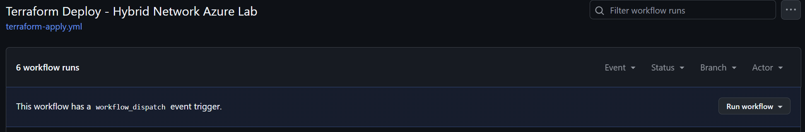

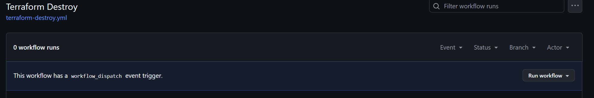

Teardown has to be as easy as deployment or it does not happen. It has since been used:

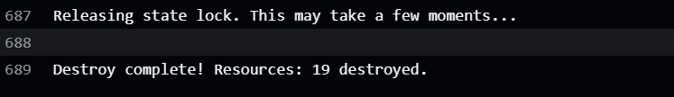

Nineteen in roughly 17 minutes, and the first authoritative count of what the lab consists of.

**Left behind:** the apply step's condition still required a `push` event that no longer existed, so it was skipped on every run while the job reported success. Fixed in Phase 0.

---

### Stage 5: Documentation

Writing it up found three things reading the code had not: the orphaned public IP, the skipped apply step, and that state is reached via an access key looked up through the management plane rather than by the service principal authenticating to blob storage, which is why `Microsoft.Storage/*` is in the custom role.

---

## Phase 0: Prerequisites and pipeline fixes

Done with the subscription empty, immediately after a destroy. Deliberate timing: changing the subnet map with resources deployed means `moved` blocks or a 45-minute gateway rebuild.

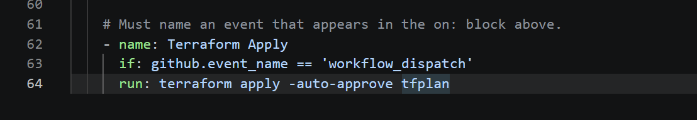

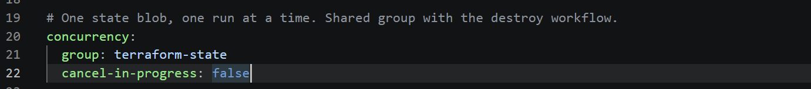

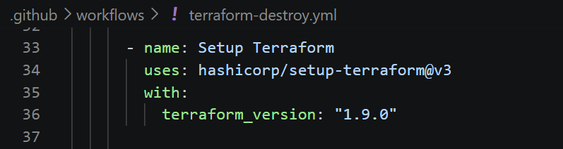

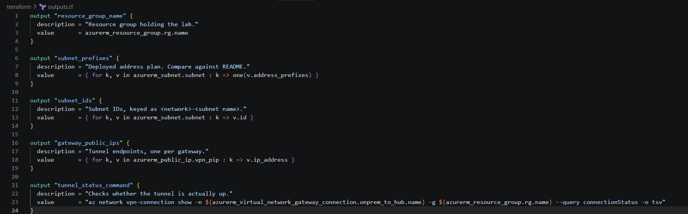

Also in this phase, without screenshots because they are config diffs: subnet values became objects so they can carry delegation and, later, route tables and NSGs; a `has_gateway` flag removed the orphaned public IP; and the bootstrap script now writes both OIDC subject formats.

Composite subnet keys were left identical, so nine subnets refreshed against their existing state addresses with nothing replaced.

The proof is not any of the above:

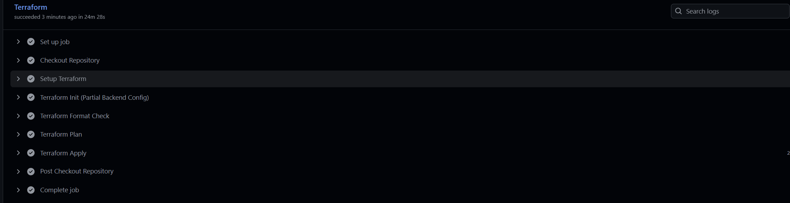

Twenty-four minutes in the apply step rather than skipping it. Duration is the giveaway.

**End state:** 21 resources, subnets 6 to 9, public IPs 3 to 2. Evidence in [validation/phase-0-pipeline.md](validation/phase-0-pipeline.md).

---

## Phase 2: Workloads, NSGs and access

Two Ubuntu VMs, one per workload subnet, no public IPs. Subnet NSGs alongside them rather than after, ungated, each ending in an explicit deny-all that overrides Azure's permissive `AllowVnetInBound` default.

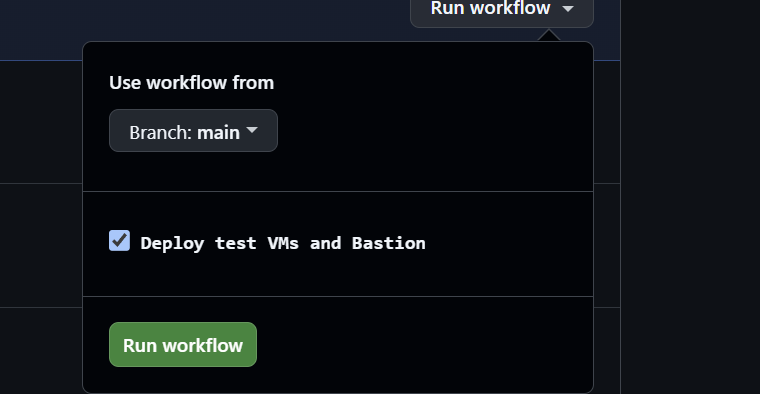

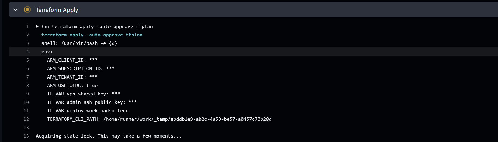

Compute is opt-in per run rather than committed to the repo.

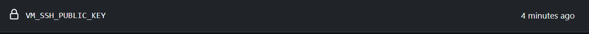

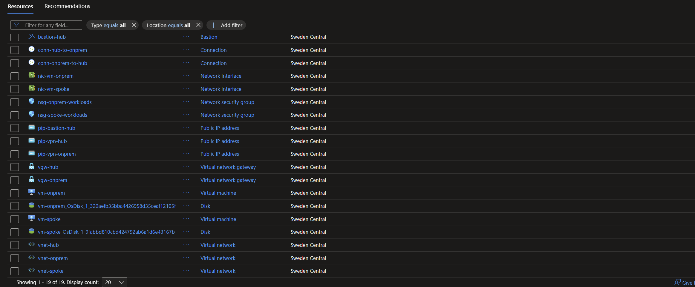

Two failures cost a deploy cycle each, an [ed25519 key the provider refused](troubleshooting.md#8-provider-rejects-ed25519-ssh-keys) and a [VM size with no capacity in the region](troubleshooting.md#9-vm-size-not-available-in-the-region). A third, [Bastion not reaching the on-premises VNet](troubleshooting.md#10-bastion-cannot-reach-the-on-premises-vnet), remained open in Phase 2. Phase 3 resolved operational access by moving Bastion into the on-premises VNet, while the underlying cross-gateway service limitation remains.

Then the thing this phase exists for:

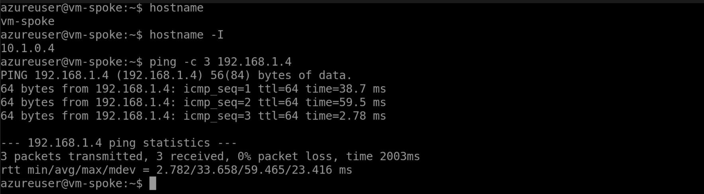

First real traffic in the project. Until this, the topology was believed to work because Azure reported both connections as `Connected`, which is a status field rather than evidence.

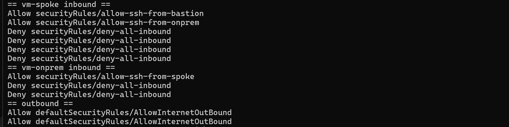

Eleven assertions, all as intended. The row worth reading twice is SSH from the hub gateway subnet to the spoke, denied by `deny-all-inbound`, because Azure's defaults would have allowed it.

Full matrix, the wire-level checks and the Phase 3 baselines are in [validation/phase-2-connectivity.md](validation/phase-2-connectivity.md).

**End state:** a packet has crossed the tunnel, the NSGs are scoped rather than merely present, and egress and DNS baselines are recorded for the next two phases.

---

## Phase 3: Firewall, forced routing and regional migration

Phase 3 changed the lab from connected networks into inspected networks. Azure Firewall Standard now sits in the hub, UDRs force the spoke-to-on-prem path through it in both directions, and Log Analytics records the decisions for the captured application requests.

### Pipeline permissions

The GitHub Actions custom role needed additional actions for Azure Firewall, firewall policy, route tables, diagnostic settings, and Log Analytics.

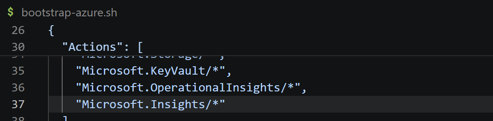

The role definition was updated through Azure CLI rather than broadening the pipeline to Contributor.

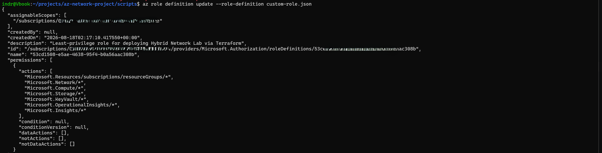

The pull request checks passed before the manually triggered deployment.

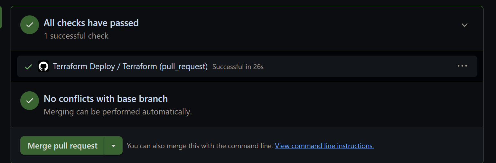

### The regional quota changed the topology

The first apply failed when the firewall public IP exceeded the Sweden Central regional public-IP quota.

Rather than request a larger quota for a temporary lab, the simulated on-premises VNet, VPN gateway, workload VM, and Bastion were moved to Denmark East. The Azure hub and spoke remained in Sweden Central. This split the public IPs across regions and made the simulated datacenter boundary more realistic.

The refactored deployment then completed successfully:

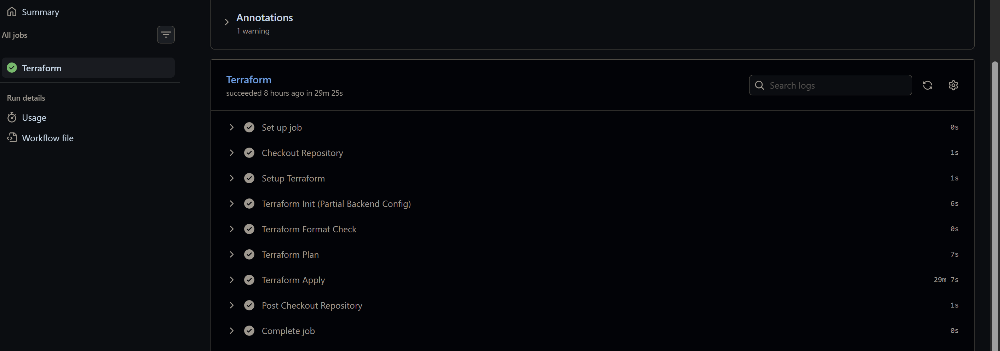

The failure and migration are documented in [troubleshooting.md](troubleshooting.md#12-deployment-failed-with-publicipcountlimitreached).

### Firewall and routing outcome

The deployed policy contains explicit cross-premises network rules for ICMP and SSH. The spoke workload route table sends the on-premises prefix and default route to firewall private IP `10.0.1.4`; a second route table on the hub gateway subnet sends the spoke prefix to the same next hop for the return path.

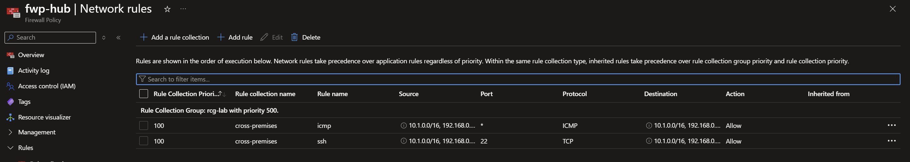

Ping and SSH still succeed after the UDRs are activated, and traceroute reaches each remote workload on the second hop. The configuration contains matching ICMP and SSH allows; the captured screenshots do not include `AZFWNetworkRule` entries that tie those individual sessions to the named rules. Application-rule logs do prove that the captured HTTP traffic traverses the firewall.

The initial `nmap` result appeared to show ports 80 and 443 open. Follow-up `nc`, `curl`, and Log Analytics evidence resolved the discrepancy: Azure Firewall can establish or intercept the TCP connection before making its application-layer decision. HTTP from on-prem to spoke receives firewall status `470` and a default deny; raw-IP HTTPS is denied because the TLS request has no usable SNI hostname.

The complete evidence and interpretation are in [validation/phase-3-route+firewall.md](validation/phase-3-route+firewall.md).

**End state:** Azure Firewall Standard, symmetric UDRs, explicit ICMP/SSH allows, default application denies, diagnostic logging, and a two-region hybrid topology. Phase 3 is complete.

---

## Phase 4: Private Link and Key Vault

Phase 4 gave the spoke workload a private PaaS path: a Key Vault with public access disabled, a
private endpoint in `snet-privatelink`, a private DNS record, and managed-identity authorization for
`vm-spoke`.

### Build and pipeline corrections

The implementation introduced the `random` provider for the globally unique vault name and updated
the lock file for Linux runner platforms. Two configuration mistakes were caught by plan before
deployment: the private DNS VNet link used legacy arguments that AzureRM 5.x rejected, and VM
`custom_data` had been nested inside an identity block instead of placed at virtual-machine resource
scope.

The first apply then failed while Terraform checked the proposed `demo-secret` resource. The GitHub
Actions identity had no Key Vault secret data-plane assignment, and a GitHub-hosted runner is outside
the private network in any case.

The secret resource was removed. Phase 4 now keeps the Key Vault demo secret out of Terraform and
tests the real workload pattern instead: the VM requests a token from IMDS and calls Key Vault over
the private endpoint. The VPN pre-shared key remains a sensitive Terraform input and, by design, is
still present in protected Terraform state.

### Workload RBAC

The first call from `vm-spoke` proved DNS and network reachability but returned `ForbiddenByRbac`.
Terraform was updated with a root-level role assignment because it wires together the VM principal
from the compute module and the vault ID from the Private Link module. The deployment identity was
bootstrapped at subscription scope with `Key Vault Data Access Administrator`. That built-in role
uses a condition to limit delegation to Key Vault data-plane roles; Terraform then assigned the
built-in `Key Vault Secrets User` role to the system-assigned VM identity at vault scope.

The follow-up deployment completed successfully:

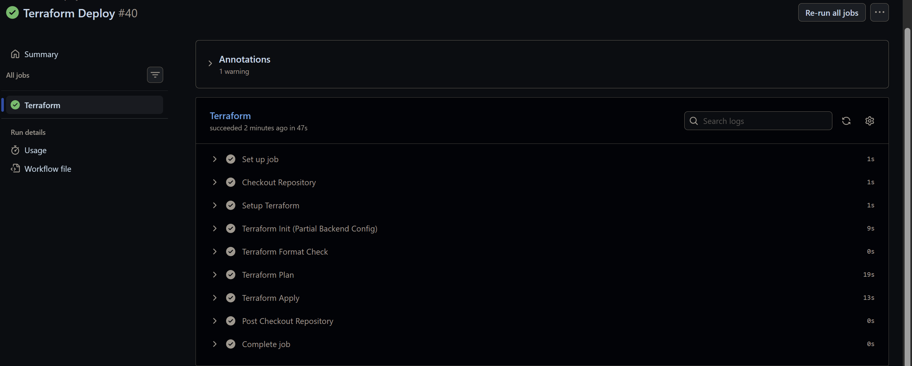

### Validation outcome

From `vm-spoke`:

- the vault FQDN resolves through `privatelink.vaultcore.azure.net` to `10.1.1.4`;
- IMDS returns a Key Vault access token for the system-assigned identity;
- the pre-assignment request is denied with `ForbiddenByRbac`;
- the post-assignment secret-list request returns HTTP 200; and
- `x-ms-keyvault-network-info` reports `conn_type=PrivateLink`, `pe-keyvault`, and source `10.1.0.4`.

Portal evidence also shows public network access disabled, the private endpoint approved, the A
record at `10.1.1.4`, and the `Key Vault Secrets User` assignment for `vm-spoke`.

The complete command output, screenshots, and acceptance matrix are in
[validation/phase-4-private-link.md](validation/phase-4-private-link.md).

**End state:** Phase 4 is complete. No Key Vault demo secret is stored by Terraform; the empty
successful secret list is the access proof. The private DNS zone is currently also linked directly
to `vnet-onprem`.
That link must be removed before Phase 5 so the DNS resolver validation cannot pass by bypassing the
resolver.
